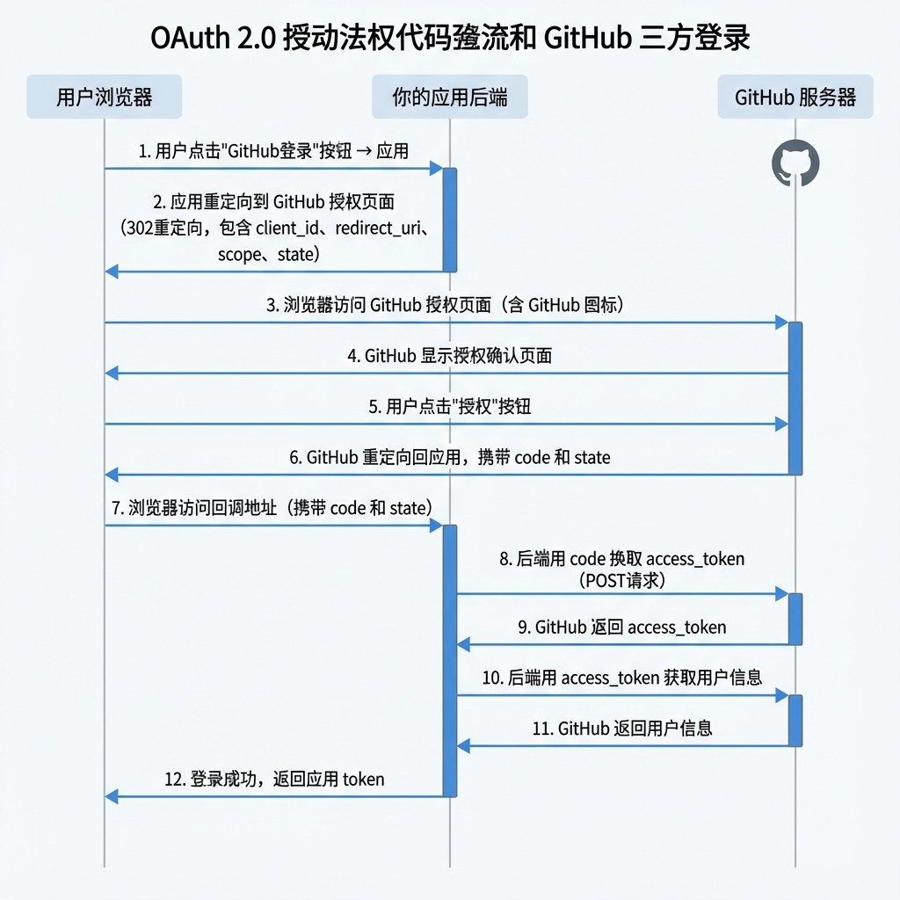
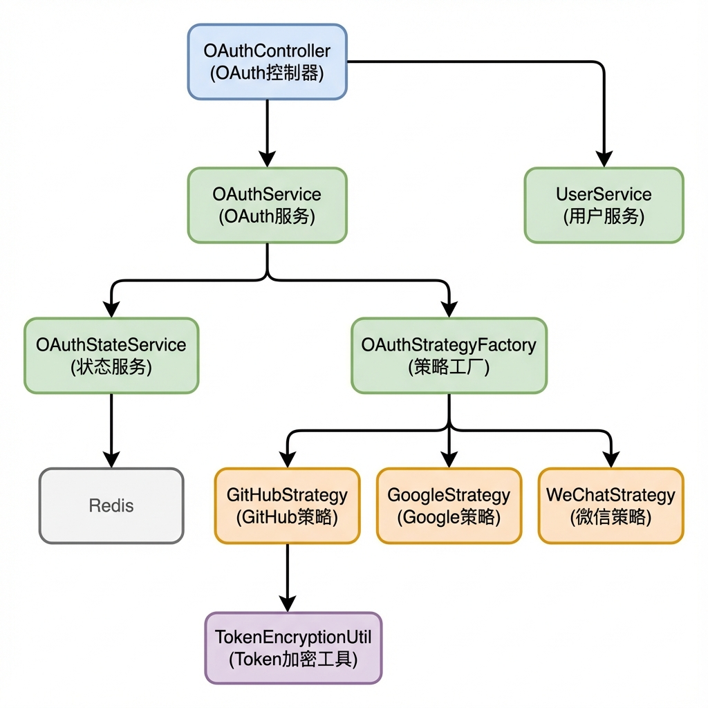

# Java 接入第三方登录完全指南

> 本文以 GitHub OAuth 为例，从原理到实践，全面讲解如何在 Spring Boot 项目中实现安全的第三方登录功能。

{/* truncate */}

---

## 目录

- [一、OAuth 2.0 协议深度解析](#一oauth-20-协议深度解析)
- [二、安全威胁与防护策略](#二安全威胁与防护策略)
- [三、注册 GitHub OAuth 应用](#三注册-github-oauth-应用)
- [四、项目架构设计](#四项目架构设计)
- [五、核心代码实现](#五核心代码实现)
- [六、安全增强实现](#六安全增强实现)
- [七、数据库设计](#七数据库设计)
- [八、前端对接](#八前端对接)
- [九、生产环境部署](#九生产环境部署)
- [十、常见问题与排查](#十常见问题与排查)
- [十一、扩展阅读](#十一扩展阅读)

---

## 一、OAuth 2.0 协议深度解析

### 1.1 什么是 OAuth 2.0？

OAuth 2.0 是一个**授权框架**（Authorization Framework），它允许第三方应用在用户授权的情况下，访问用户在某个服务上的特定资源，而**无需获取用户的密码**。

> 🔑 **核心思想**：OAuth 解决的是"授权"问题，而非"认证"问题。它让用户可以授权第三方应用访问自己的数据，同时保持密码的私密性。

### 1.2 OAuth 2.0 四种授权模式

OAuth 2.0 定义了四种授权模式，适用于不同场景：

| 模式 | 英文名 | 适用场景 | 安全性 |
|------|--------|---------|--------|
| **授权码模式** | Authorization Code | Web 应用、有后端服务器 | ⭐⭐⭐⭐⭐ 最高 |
| **隐式模式** | Implicit | 纯前端应用（已不推荐） | ⭐⭐ 较低 |
| **密码模式** | Password | 高度信任的应用（已废弃） | ⭐ 最低 |
| **客户端凭证** | Client Credentials | 服务端对服务端通信 | ⭐⭐⭐⭐ |

本文采用**授权码模式（Authorization Code）**，这是目前最安全、最常用的模式。

### 1.3 授权码模式完整流程



### 1.4 关键参数详解

#### 授权请求参数

| 参数 | 必填 | 说明 |
|------|------|------|
| `client_id` | ✅ | 应用标识，在 GitHub 注册应用时获得 |
| `redirect_uri` | ✅ | 授权成功后的回调地址，必须与注册时配置一致 |
| `scope` | ❌ | 请求的权限范围，如 `user:email`、`repo` |
| `state` | ⚠️ **强烈建议** | CSRF 防护参数，原样返回用于验证 |
| `response_type` | ✅ | 授权码模式固定为 `code` |

#### 令牌请求参数

| 参数 | 必填 | 说明 |
|------|------|------|
| `client_id` | ✅ | 应用标识 |
| `client_secret` | ✅ | 应用密钥，**必须保密** |
| `code` | ✅ | 授权码，一次性使用，有效期通常 10 分钟 |
| `redirect_uri` | ❌ | 必须与授权请求时一致 |

#### 令牌响应

| 字段 | 说明 |
|------|------|
| `access_token` | 访问令牌，用于调用 API |
| `token_type` | 令牌类型，通常为 `bearer` |
| `scope` | 实际授予的权限范围 |
| `expires_in` | 过期时间（秒），GitHub 不返回此字段表示永不过期 |
| `refresh_token` | 刷新令牌（部分平台支持） |

---

## 二、安全威胁与防护策略

OAuth 2.0 虽然设计精良，但实现不当仍会引入安全漏洞。以下是常见威胁及防护方案。

### 2.1 CSRF 攻击（跨站请求伪造）

#### 什么是 CSRF？

CSRF（Cross-Site Request Forgery）攻击是指攻击者诱导用户在已登录的状态下，点击恶意链接，从而在用户不知情的情况下完成某些操作。

#### OAuth 中的 CSRF 攻击场景

```
1. 攻击者用自己的 GitHub 账号发起授权，获得授权码 code=abc123
2. 攻击者构造恶意链接：http://你的网站/callback?code=abc123
3. 攻击者诱导受害者点击该链接
4. 受害者的账号被绑定到攻击者的 GitHub 账号！
5. 攻击者可以用自己的 GitHub 登录受害者的账号
```

这就是著名的 **"账号劫持"** 攻击。

#### CSRF 防护方案对比

| 方案 | 原理 | 优点 | 缺点 |
|------|------|------|------|
| **State 参数（推荐）** | 在授权请求中携带随机字符串，回调时验证 | OAuth 标准方案，通用性强 | 需要服务端存储 state |
| **Referer 检查** | 验证请求来源 | 实现简单 | 可被伪造或被浏览器隐私设置禁用 |
| **Double Submit Cookie** | 同时在 Cookie 和请求参数中携带 token | 无需服务端存储 | 实现复杂 |
| **SameSite Cookie** | 使用 SameSite 属性限制 Cookie | 浏览器原生支持 | 兼容性问题 |

#### 本项目的 CSRF 防护方案

我们采用 **State 参数 + Redis 存储** 的方案：

```
1. 用户点击登录，后端生成随机 state 并存入 Redis（TTL 5分钟）
2. 将 state 拼接到授权 URL 中
3. GitHub 回调时携带原样的 state
4. 后端从 Redis 获取并验证 state，验证后立即删除（一次性使用）
5. 验证失败则拒绝登录
```

**优势**：
- ✅ 完全符合 OAuth 2.0 规范
- ✅ State 存储在 Redis，支持分布式部署
- ✅ 一次性使用，防止重放攻击
- ✅ 设置 TTL，自动过期清理

### 2.2 授权码注入攻击

#### 攻击场景

攻击者获取到某个用户的授权码后，尝试在自己的会话中使用该授权码。

#### 防护方案

1. **验证 redirect_uri**：换取 token 时校验 redirect_uri 与授权请求一致
2. **授权码绑定会话**：将授权码与发起请求的 session 绑定
3. **授权码一次性使用**：使用后立即失效

本项目通过 State 参数同时实现了会话绑定和一次性使用。

### 2.3 Token 泄露风险

#### 威胁来源

- 数据库泄露
- 日志泄露
- 网络传输被截获

#### 本项目的防护措施

| 风险点 | 防护措施 |
|--------|---------|
| 数据库泄露 | access_token 使用 AES-256-GCM 加密后存储 |
| 日志泄露 | 禁止在日志中打印 token、code 等敏感信息 |
| 网络传输 | 强制 HTTPS，token 仅在后端流转 |

### 2.4 重定向 URI 劫持

#### 攻击场景

如果应用没有严格验证 redirect_uri，攻击者可以将用户重定向到恶意网站，窃取授权码。

#### 防护建议

1. **严格匹配**：redirect_uri 必须完全匹配，不使用通配符
2. **白名单验证**：维护允许的 redirect_uri 列表
3. **HTTPS 强制**：生产环境 redirect_uri 必须使用 HTTPS

---

## 三、注册 GitHub OAuth 应用

### 3.1 创建应用

1. 登录 GitHub，进入 **Settings → Developer settings → OAuth Apps**
2. 点击 **New OAuth App**
3. 填写应用信息：

| 字段 | 开发环境示例 | 生产环境示例 |
|------|-------------|-------------|
| Application name | LeetCode Clone Dev | LeetCode Clone |
| Homepage URL | `http://localhost:5173` | `https://leetcode.example.com` |
| Authorization callback URL | `http://localhost:8001/api/user/oauth/callback/github` | `https://api.leetcode.example.com/oauth/callback/github` |

4. 点击 **Register application**

### 3.2 获取凭证

创建成功后，你会看到：

- **Client ID**：公开的应用标识，可以放在前端代码中
- **Client Secret**：**必须保密**，只能存放在后端

> ⚠️ **安全提示**：切勿将 Client Secret 提交到 Git 仓库，应使用环境变量管理

### 3.3 多环境配置

建议为不同环境创建独立的 OAuth App：

```yaml
# application-dev.yaml（开发环境）
oauth:
  github:
    client-id: ${GITHUB_CLIENT_ID_DEV}
    client-secret: ${GITHUB_CLIENT_SECRET_DEV}

# application-prod.yaml（生产环境）
oauth:
  github:
    client-id: ${GITHUB_CLIENT_ID_PROD}
    client-secret: ${GITHUB_CLIENT_SECRET_PROD}
```

---

## 四、项目架构设计

### 4.1 整体架构



### 4.2 设计模式应用

#### 策略模式（Strategy Pattern）

**问题**：不同第三方平台（GitHub、Google、微信）的授权流程相似，但具体实现不同。

**解决方案**：定义统一的策略接口，每个平台实现自己的策略类。

```java
/**
 * OAuth 策略接口
 * 定义所有第三方平台必须实现的方法
 */
public interface OAuthStrategy {
    
    /**
     * 获取平台标识（如 github、google）
     */
    String getProvider();
    
    /**
     * 构建授权 URL
     * @param state CSRF 防护参数
     */
    String getAuthorizeUrl(String state);
    
    /**
     * 用授权码换取用户信息
     * @param code 一次性授权码
     */
    OAuthUserInfo getUserInfo(String code);
    
    /**
     * 创建新用户并绑定第三方账号
     */
    Long createUserOAuth(OAuthUserInfo userInfo);
}
```

**优势**：
- ✅ 新增平台只需添加新的策略类，无需修改现有代码
- ✅ 符合开闭原则（对扩展开放，对修改关闭）
- ✅ 便于单元测试

#### 工厂模式（Factory Pattern）

**问题**：需要根据平台名称动态获取对应的策略实现。

**解决方案**：使用策略工厂统一管理所有策略实例。

```java
@Component
public class OAuthStrategyFactory {
    
    private final Map<String, OAuthStrategy> strategyMap;
    
    /**
     * Spring 自动注入所有 OAuthStrategy 实现类
     */
    @Autowired
    public OAuthStrategyFactory(List<OAuthStrategy> strategies) {
        this.strategyMap = strategies.stream()
                .collect(Collectors.toMap(
                        s -> s.getProvider().toLowerCase(),
                        Function.identity()
                ));
    }
    
    public OAuthStrategy getStrategy(String provider) {
        OAuthStrategy strategy = strategyMap.get(provider.toLowerCase());
        if (strategy == null) {
            throw new IllegalArgumentException("不支持的OAuth平台: " + provider);
        }
        return strategy;
    }
}
```

**优势**：
- ✅ 利用 Spring 依赖注入自动发现策略类
- ✅ 统一的获取入口，便于管理
- ✅ 支持运行时动态切换策略

---

## 五、核心代码实现

### 5.1 配置文件

```yaml
# application.yaml
server:
  port: 8001
  servlet:
    context-path: /api/user

spring:
  data:
    redis:
      host: localhost
      port: 6379

# OAuth 配置
oauth:
  # 安全配置
  security:
    # AES 加密密钥（32字节），生产环境必须通过环境变量设置
    encryption-key: ${OAUTH_ENCRYPTION_KEY:default32ByteSecretKeyForDev123}
    # State 过期时间（秒）
    state-ttl: 300
  
  # GitHub 配置
  github:
    client-id: ${GITHUB_CLIENT_ID:your-client-id}
    client-secret: ${GITHUB_CLIENT_SECRET:your-client-secret}
  
  # Google 配置（可选）
  google:
    client-id: ${GOOGLE_CLIENT_ID:}
    client-secret: ${GOOGLE_CLIENT_SECRET:}
```

### 5.2 数据模型

#### OAuth 用户信息（中间对象）

```java
@Data
@Builder
@NoArgsConstructor
@AllArgsConstructor
public class OAuthUserInfo {
    
    /** 第三方平台用户ID */
    private String providerUserId;
    
    /** 第三方平台用户名 */
    private String providerUsername;
    
    /** 邮箱 */
    private String email;
    
    /** 头像URL */
    private String avatarUrl;
    
    /** 访问令牌（临时持有，存储前需加密） */
    private String accessToken;
}
```

#### State 载荷

```java
@Data
@Builder
@NoArgsConstructor
@AllArgsConstructor
public class OAuthStatePayload {
    
    /** 操作类型：LOGIN（登录）或 BIND（绑定） */
    private OAuthStateType type;
    
    /** 用户ID（绑定场景使用） */
    private Long userId;
    
    /** OAuth 平台 */
    private String provider;
    
    /** 创建时间戳 */
    private Long timestamp;
}
```

### 5.3 GitHub 策略实现

```java
@Slf4j
@Component
@RequiredArgsConstructor
public class GitHubOAuthStrategy implements OAuthStrategy {

    private final UserMapper userMapper;
    private final UserOAuthMapper userOAuthMapper;
    private final TokenEncryptionUtil tokenEncryptionUtil;

    @Value("${oauth.github.client-id}")
    private String clientId;
    
    @Value("${oauth.github.client-secret}")
    private String clientSecret;

    // GitHub OAuth 端点
    private static final String AUTHORIZE_URL = "https://github.com/login/oauth/authorize";
    private static final String ACCESS_TOKEN_URL = "https://github.com/login/oauth/access_token";
    private static final String USER_INFO_URL = "https://api.github.com/user";
    private static final String REDIRECT_URI = "http://localhost:8001/api/user/oauth/callback/github";

    @Override
    public String getProvider() {
        return "github";
    }

    @Override
    public String getAuthorizeUrl(String state) {
        // 构建授权 URL，包含 state 参数防止 CSRF
        return String.format(
                "%s?client_id=%s&redirect_uri=%s&scope=user:email&state=%s",
                AUTHORIZE_URL, clientId, REDIRECT_URI, state
        );
    }

    @Override
    public OAuthUserInfo getUserInfo(String code) {
        // 第一步：用授权码换取 access_token
        String accessToken = exchangeCodeForToken(code);
        
        // 第二步：用 access_token 获取用户信息
        return fetchUserInfo(accessToken);
    }
    
    /**
     * 用授权码换取 access_token
     */
    private String exchangeCodeForToken(String code) {
        Map<String, Object> params = new HashMap<>();
        params.put("client_id", clientId);
        params.put("client_secret", clientSecret);
        params.put("code", code);

        String response = HttpUtil.post(ACCESS_TOKEN_URL, params);
        log.debug("GitHub token 请求完成");  // 不要打印响应内容！

        return parseAccessToken(response);
    }
    
    /**
     * 解析 access_token
     * GitHub 可能返回两种格式：URL 编码 或 JSON
     */
    private String parseAccessToken(String response) {
        // 尝试 JSON 格式
        try {
            JSONObject json = JSON.parseObject(response);
            if (json.containsKey("access_token")) {
                return json.getString("access_token");
            }
            if (json.containsKey("error")) {
                throw new RuntimeException("GitHub 授权失败: " + json.getString("error_description"));
            }
        } catch (JSONException ignored) {}

        // URL 编码格式: access_token=xxx&token_type=bearer&scope=user:email
        for (String param : response.split("&")) {
            String[] pair = param.split("=", 2);
            if (pair.length == 2 && "access_token".equals(pair[0])) {
                return pair[1];
            }
        }
        
        throw new RuntimeException("无法解析 GitHub access_token");
    }
    
    /**
     * 获取 GitHub 用户信息
     */
    private OAuthUserInfo fetchUserInfo(String accessToken) {
        try (HttpResponse response = HttpRequest.get(USER_INFO_URL)
                .header("Authorization", "token " + accessToken)
                .header("Accept", "application/json")
                .execute()) {
            
            JSONObject user = JSON.parseObject(response.body());
            
            return OAuthUserInfo.builder()
                    .providerUserId(user.getString("id"))
                    .providerUsername(user.getString("login"))
                    .email(user.getString("email"))
                    .avatarUrl(user.getString("avatar_url"))
                    .accessToken(accessToken)
                    .build();
        }
    }

    @Override
    @Transactional
    public Long createUserOAuth(OAuthUserInfo info) {
        // 1. 创建用户记录
        User user = User.builder()
                .username(info.getProviderUsername())
                .email(info.getEmail())
                .nickname(info.getProviderUsername())
                .avatar(info.getAvatarUrl())
                .build();
        userMapper.insert(user);
        log.info("创建新用户: {}", user.getUsername());

        // 2. 加密 token 并创建绑定关系
        String encryptedToken = tokenEncryptionUtil.encrypt(info.getAccessToken());
        
        UserOAuth binding = UserOAuth.builder()
                .userId(user.getId())
                .provider("github")
                .providerUserId(info.getProviderUserId())
                .providerUsername(info.getProviderUsername())
                .accessToken(encryptedToken)
                .avatarUrl(info.getAvatarUrl())
                .email(info.getEmail())
                .build();
        userOAuthMapper.insert(binding);
        
        log.info("用户 {} 绑定 GitHub 成功", user.getUsername());
        return user.getId();
    }
}
```

### 5.4 Service 层

```java
@Slf4j
@Service
@RequiredArgsConstructor
public class OAuthServiceImpl implements OAuthService {

    private final OAuthStrategyFactory strategyFactory;
    private final OAuthStateService stateService;
    private final TokenEncryptionUtil tokenEncryptionUtil;
    private final UserOAuthMapper userOAuthMapper;

    @Override
    public String getAuthorizeUrl(String provider) {
        // 1. 生成 state 并存入 Redis
        String state = stateService.generateLoginState(provider);
        
        // 2. 获取策略并构建授权 URL
        OAuthStrategy strategy = strategyFactory.getStrategy(provider);
        return strategy.getAuthorizeUrl(state);
    }

    @Override
    @Transactional
    public String handleCallback(String provider, String code, String state) {
        // 1. 验证 state（CSRF 防护）
        OAuthStatePayload payload = stateService.validateAndConsumeState(state);
        if (payload == null) {
            throw new ClientException("授权已过期，请重新登录");
        }
        
        // 2. 验证 state 类型和平台
        if (payload.getType() != OAuthStateType.LOGIN) {
            throw new ClientException("无效的授权类型");
        }
        if (!provider.equalsIgnoreCase(payload.getProvider())) {
            throw new ClientException("授权来源不匹配");
        }

        // 3. 获取第三方用户信息
        OAuthStrategy strategy = strategyFactory.getStrategy(provider);
        OAuthUserInfo userInfo = strategy.getUserInfo(code);

        // 4. 查询是否已绑定
        UserOAuth existing = userOAuthMapper.selectOne(
                Wrappers.<UserOAuth>lambdaQuery()
                        .eq(UserOAuth::getProvider, provider.toLowerCase())
                        .eq(UserOAuth::getProviderUserId, userInfo.getProviderUserId())
        );
        
        Long userId;
        if (existing == null) {
            // 新用户：创建账号并绑定
            userId = strategy.createUserOAuth(userInfo);
        } else {
            // 老用户：直接获取用户ID
            userId = existing.getUserId();
        }

        // 5. 登录并返回 token
        StpUtil.login(userId);
        return StpUtil.getTokenValue();
    }
    
    @Override
    public String getBindAuthorizeUrl(String provider, Long userId) {
        // 绑定场景：state 中包含用户ID
        String state = stateService.generateBindState(provider, userId);
        OAuthStrategy strategy = strategyFactory.getStrategy(provider);
        return strategy.getAuthorizeUrl(state);
    }
    
    @Override
    @Transactional
    public void handleBindCallback(String provider, String code, String state) {
        // 1. 验证 state 并提取用户ID
        OAuthStatePayload payload = stateService.validateAndConsumeState(state);
        if (payload == null || payload.getType() != OAuthStateType.BIND) {
            throw new ClientException("授权已过期，请重新绑定");
        }
        
        Long userId = payload.getUserId();
        
        // 2. 获取第三方用户信息
        OAuthStrategy strategy = strategyFactory.getStrategy(provider);
        OAuthUserInfo userInfo = strategy.getUserInfo(code);
        
        // 3. 检查是否已被其他用户绑定
        UserOAuth existing = userOAuthMapper.selectOne(
                Wrappers.<UserOAuth>lambdaQuery()
                        .eq(UserOAuth::getProvider, provider.toLowerCase())
                        .eq(UserOAuth::getProviderUserId, userInfo.getProviderUserId())
        );
        
        if (existing != null) {
            if (existing.getUserId().equals(userId)) {
                throw new ClientException("您已绑定该账号");
            } else {
                throw new ClientException("该账号已被其他用户绑定");
            }
        }
        
        // 4. 创建绑定关系
        String encryptedToken = tokenEncryptionUtil.encrypt(userInfo.getAccessToken());
        UserOAuth binding = UserOAuth.builder()
                .userId(userId)
                .provider(provider.toLowerCase())
                .providerUserId(userInfo.getProviderUserId())
                .providerUsername(userInfo.getProviderUsername())
                .accessToken(encryptedToken)
                .avatarUrl(userInfo.getAvatarUrl())
                .email(userInfo.getEmail())
                .build();
        userOAuthMapper.insert(binding);
        
        log.info("用户 {} 绑定 {} 成功", userId, provider);
    }
}
```

### 5.5 Controller 层

```java
@Slf4j
@RestController
@RequestMapping("/oauth")
@RequiredArgsConstructor
public class OAuthController {

    private final OAuthService oauthService;

    /**
     * 发起 OAuth 授权
     * GET /oauth/authorize/{provider}
     */
    @GetMapping("/authorize/{provider}")
    public void authorize(@PathVariable String provider, 
                          HttpServletResponse response) throws IOException {
        String authorizeUrl = oauthService.getAuthorizeUrl(provider);
        response.sendRedirect(authorizeUrl);
    }

    /**
     * OAuth 回调处理
     * GET /oauth/callback/{provider}?code=xxx&state=xxx
     */
    @GetMapping("/callback/{provider}")
    public void callback(@PathVariable String provider,
                         @RequestParam("code") String code,
                         @RequestParam(value = "state", required = false) String state,
                         HttpServletResponse response) throws IOException {
        log.info("OAuth 回调: provider={}", provider);
        
        try {
            String token = oauthService.handleCallback(provider, code, state);
            
            // 重定向到前端，携带登录 token
            response.sendRedirect("http://localhost:5173/oauth/callback?token=" + token);
            
        } catch (Exception e) {
            log.error("OAuth 登录失败: {}", e.getMessage());
            response.sendRedirect("http://localhost:5173/login?error=" + 
                    URLEncoder.encode(e.getMessage(), StandardCharsets.UTF_8));
        }
    }

    /**
     * 绑定第三方账号（需登录）
     */
    @GetMapping("/bind/{provider}")
    public void bind(@PathVariable String provider, 
                     HttpServletResponse response) throws IOException {
        Long userId = StpUtil.getLoginIdAsLong();
        String authorizeUrl = oauthService.getBindAuthorizeUrl(provider, userId);
        response.sendRedirect(authorizeUrl);
    }

    /**
     * 绑定回调处理
     */
    @GetMapping("/bind/callback/{provider}")
    public void bindCallback(@PathVariable String provider,
                             @RequestParam("code") String code,
                             @RequestParam("state") String state,
                             HttpServletResponse response) throws IOException {
        try {
            oauthService.handleBindCallback(provider, code, state);
            response.sendRedirect("http://localhost:5173/settings?bind=success");
        } catch (Exception e) {
            log.error("绑定失败: {}", e.getMessage());
            response.sendRedirect("http://localhost:5173/settings?bind=error&message=" + 
                    URLEncoder.encode(e.getMessage(), StandardCharsets.UTF_8));
        }
    }
}
```

---

## 六、安全增强实现

### 6.1 State 管理服务

```java
@Slf4j
@Service
@RequiredArgsConstructor
public class OAuthStateServiceImpl implements OAuthStateService {
    
    private static final String STATE_KEY_PREFIX = "oauth:state:";
    
    private final StringRedisTemplate redisTemplate;
    
    @Value("${oauth.security.state-ttl:300}")
    private long stateTtl;

    @Override
    public String generateLoginState(String provider) {
        return generateState(OAuthStateType.LOGIN, provider, null);
    }
    
    @Override
    public String generateBindState(String provider, Long userId) {
        if (userId == null) {
            throw new IllegalArgumentException("绑定场景必须提供用户ID");
        }
        return generateState(OAuthStateType.BIND, provider, userId);
    }

    @Override
    public OAuthStatePayload validateAndConsumeState(String state) {
        if (state == null || state.isBlank()) {
            log.warn("State 参数为空");
            return null;
        }
        
        String key = STATE_KEY_PREFIX + state;
        
        // 获取并删除（原子操作，确保一次性使用）
        String json = redisTemplate.opsForValue().getAndDelete(key);
        
        if (json == null) {
            log.warn("State 无效或已过期: {}", state);
            return null;
        }
        
        try {
            OAuthStatePayload payload = JSON.parseObject(json, OAuthStatePayload.class);
            log.info("State 验证成功: type={}, provider={}", 
                    payload.getType(), payload.getProvider());
            return payload;
        } catch (Exception e) {
            log.error("State 解析失败", e);
            return null;
        }
    }
    
    private String generateState(OAuthStateType type, String provider, Long userId) {
        // 生成 32 位随机字符串
        String state = UUID.randomUUID().toString().replace("-", "");
        
        OAuthStatePayload payload = OAuthStatePayload.builder()
                .type(type)
                .provider(provider)
                .userId(userId)
                .timestamp(System.currentTimeMillis())
                .build();
        
        String key = STATE_KEY_PREFIX + state;
        String json = JSON.toJSONString(payload);
        
        redisTemplate.opsForValue().set(key, json, stateTtl, TimeUnit.SECONDS);
        
        log.info("生成 State: type={}, provider={}, ttl={}s", type, provider, stateTtl);
        return state;
    }
}
```

### 6.2 Token 加密工具

```java
@Slf4j
@Component
public class TokenEncryptionUtil {
    
    private static final String ALGORITHM = "AES";
    private static final String TRANSFORMATION = "AES/GCM/NoPadding";
    private static final int GCM_IV_LENGTH = 12;   // GCM 推荐 IV 长度
    private static final int GCM_TAG_LENGTH = 128; // 认证标签长度（bits）

    @Value("${oauth.security.encryption-key}")
    private String encryptionKey;

    /**
     * AES-GCM 加密
     * 
     * @param plainText 明文
     * @return Base64(IV + 密文)
     */
    public String encrypt(String plainText) {
        if (plainText == null || plainText.isBlank()) {
            return plainText;
        }
        
        try {
            // 1. 生成随机 IV
            byte[] iv = new byte[GCM_IV_LENGTH];
            new SecureRandom().nextBytes(iv);

            // 2. 初始化加密器
            SecretKeySpec keySpec = new SecretKeySpec(getKeyBytes(), ALGORITHM);
            GCMParameterSpec gcmSpec = new GCMParameterSpec(GCM_TAG_LENGTH, iv);
            
            Cipher cipher = Cipher.getInstance(TRANSFORMATION);
            cipher.init(Cipher.ENCRYPT_MODE, keySpec, gcmSpec);

            // 3. 加密
            byte[] encrypted = cipher.doFinal(plainText.getBytes(StandardCharsets.UTF_8));

            // 4. IV + 密文 拼接，Base64 编码
            byte[] combined = new byte[iv.length + encrypted.length];
            System.arraycopy(iv, 0, combined, 0, iv.length);
            System.arraycopy(encrypted, 0, combined, iv.length, encrypted.length);

            return Base64.getEncoder().encodeToString(combined);
            
        } catch (Exception e) {
            log.error("加密失败", e);
            throw new RuntimeException("Token 加密失败", e);
        }
    }

    /**
     * AES-GCM 解密
     * 
     * @param cipherText Base64(IV + 密文)
     * @return 明文
     */
    public String decrypt(String cipherText) {
        if (cipherText == null || cipherText.isBlank()) {
            return cipherText;
        }
        
        try {
            // 1. Base64 解码
            byte[] combined = Base64.getDecoder().decode(cipherText);

            // 2. 分离 IV 和密文
            byte[] iv = new byte[GCM_IV_LENGTH];
            byte[] encrypted = new byte[combined.length - GCM_IV_LENGTH];
            System.arraycopy(combined, 0, iv, 0, iv.length);
            System.arraycopy(combined, iv.length, encrypted, 0, encrypted.length);

            // 3. 初始化解密器
            SecretKeySpec keySpec = new SecretKeySpec(getKeyBytes(), ALGORITHM);
            GCMParameterSpec gcmSpec = new GCMParameterSpec(GCM_TAG_LENGTH, iv);
            
            Cipher cipher = Cipher.getInstance(TRANSFORMATION);
            cipher.init(Cipher.DECRYPT_MODE, keySpec, gcmSpec);

            // 4. 解密
            byte[] decrypted = cipher.doFinal(encrypted);
            return new String(decrypted, StandardCharsets.UTF_8);
            
        } catch (Exception e) {
            log.error("解密失败", e);
            throw new RuntimeException("Token 解密失败", e);
        }
    }

    /**
     * 获取 32 字节密钥（AES-256）
     */
    private byte[] getKeyBytes() {
        byte[] keyBytes = encryptionKey.getBytes(StandardCharsets.UTF_8);
        
        if (keyBytes.length < 32) {
            // 不足 32 字节，填充 0
            byte[] padded = new byte[32];
            System.arraycopy(keyBytes, 0, padded, 0, keyBytes.length);
            return padded;
        } else if (keyBytes.length > 32) {
            // 超过 32 字节，截断
            byte[] truncated = new byte[32];
            System.arraycopy(keyBytes, 0, truncated, 0, 32);
            return truncated;
        }
        
        return keyBytes;
    }
}
```

---

## 七、数据库设计

### 7.1 表结构

```sql
-- 第三方账号绑定表
CREATE TABLE `user_oauth` (
    `id`                BIGINT(20)   NOT NULL AUTO_INCREMENT COMMENT '主键ID',
    `user_id`           BIGINT(20)   NOT NULL COMMENT '用户ID（关联 user 表）',
    `provider`          VARCHAR(50)  NOT NULL COMMENT '第三方平台：github, google, wechat, qq',
    `provider_user_id`  VARCHAR(255) NOT NULL COMMENT '第三方平台的用户ID',
    `provider_username` VARCHAR(255) DEFAULT NULL COMMENT '第三方平台的用户名',
    `access_token`      TEXT         DEFAULT NULL COMMENT '访问令牌（AES-GCM 加密存储）',
    `refresh_token`     TEXT         DEFAULT NULL COMMENT '刷新令牌（AES-GCM 加密存储）',
    `expires_at`        DATETIME     DEFAULT NULL COMMENT '令牌过期时间',
    `avatar_url`        VARCHAR(512) DEFAULT NULL COMMENT '第三方平台头像URL',
    `email`             VARCHAR(255) DEFAULT NULL COMMENT '第三方平台邮箱',
    `extra_info`        JSON         DEFAULT NULL COMMENT '扩展信息（JSON格式）',
    `create_time`       DATETIME     NOT NULL DEFAULT CURRENT_TIMESTAMP COMMENT '绑定时间',
    `update_time`       DATETIME     NOT NULL DEFAULT CURRENT_TIMESTAMP ON UPDATE CURRENT_TIMESTAMP COMMENT '更新时间',
    `deleted`           TINYINT(1)   NOT NULL DEFAULT 0 COMMENT '逻辑删除：0-未删除，1-已删除',
    
    PRIMARY KEY (`id`),
    -- 确保同一平台的同一用户只能绑定一次
    UNIQUE KEY `uk_provider_user` (`provider`, `provider_user_id`, `deleted`),
    -- 查询用户绑定列表的索引
    INDEX `idx_user_id` (`user_id`)
) ENGINE=InnoDB DEFAULT CHARSET=utf8mb4 COMMENT='第三方账号绑定表';
```

### 7.2 实体类

```java
@Data
@Builder
@NoArgsConstructor
@AllArgsConstructor
@TableName("user_oauth")
public class UserOAuth {
    
    @TableId(type = IdType.AUTO)
    private Long id;
    
    private Long userId;
    
    private String provider;
    
    private String providerUserId;
    
    private String providerUsername;
    
    /** 加密后的访问令牌 */
    private String accessToken;
    
    /** 加密后的刷新令牌 */
    private String refreshToken;
    
    private LocalDateTime expiresAt;
    
    private String avatarUrl;
    
    private String email;
    
    private String extraInfo;
    
    @TableField(fill = FieldFill.INSERT)
    private LocalDateTime createTime;
    
    @TableField(fill = FieldFill.INSERT_UPDATE)
    private LocalDateTime updateTime;
    
    @TableLogic
    private Integer deleted;
}
```

---

## 八、前端对接

### 8.1 发起登录

```tsx
// LoginPage.tsx
const handleGitHubLogin = () => {
    // 直接跳转到后端 OAuth 入口
    window.location.href = 'http://localhost:8001/api/user/oauth/authorize/github';
};

return (
    <button onClick={handleGitHubLogin}>
        <GitHubIcon /> 使用 GitHub 登录
    </button>
);
```

### 8.2 处理回调

```tsx
// OAuthCallback.tsx
import { useEffect } from 'react';
import { useSearchParams, useNavigate } from 'react-router-dom';
import { useUser } from '@/contexts/UserContext';

export function OAuthCallback() {
    const [searchParams] = useSearchParams();
    const navigate = useNavigate();
    const { login } = useUser();

    useEffect(() => {
        const token = searchParams.get('token');
        const error = searchParams.get('error');
        
        if (error) {
            // 登录失败
            alert('登录失败: ' + decodeURIComponent(error));
            navigate('/login');
            return;
        }
        
        if (token) {
            // 登录成功，保存 token 并获取用户信息
            login(token).then(() => {
                navigate('/');
            });
        } else {
            navigate('/login');
        }
    }, [searchParams, navigate, login]);

    return (
        <div className="loading-container">
            <Spinner />
            <p>正在登录...</p>
        </div>
    );
}
```

### 8.3 路由配置

```tsx
// App.tsx
import { OAuthCallback } from '@/pages/OAuthCallback';

const router = createBrowserRouter([
    // ...其他路由
    {
        path: '/oauth/callback',
        element: <OAuthCallback />
    }
]);
```

---

## 九、生产环境部署

### 9.1 环境变量配置

```bash
# .env.production
GITHUB_CLIENT_ID=your-production-client-id
GITHUB_CLIENT_SECRET=your-production-client-secret

# 必须是 32 字节的随机字符串
OAUTH_ENCRYPTION_KEY=your-32-byte-random-production-key

# 可选：其他平台
GOOGLE_CLIENT_ID=...
GOOGLE_CLIENT_SECRET=...
```

### 9.2 HTTPS 配置

**重要**：生产环境必须使用 HTTPS！

```yaml
# application-prod.yaml
server:
  ssl:
    enabled: true
    key-store: classpath:keystore.p12
    key-store-password: ${SSL_KEYSTORE_PASSWORD}
    key-store-type: PKCS12
```

### 9.3 回调地址更新

生产环境的回调地址需要更新为真实域名：

1. 修改 GitHub OAuth App 的 callback URL
2. 更新代码中的 `REDIRECT_URI` 常量
3. 更新前端重定向地址

建议使用配置文件管理这些地址：

```yaml
# application-prod.yaml
oauth:
  github:
    redirect-uri: https://api.example.com/oauth/callback/github
  frontend:
    callback-url: https://example.com/oauth/callback
    settings-url: https://example.com/settings
```

### 9.4 安全检查清单

- [ ] 所有通信使用 HTTPS
- [ ] Client Secret 通过环境变量配置，不在代码中硬编码
- [ ] 加密密钥足够随机且长度为 32 字节
- [ ] 日志中不包含敏感信息（token、code、secret）
- [ ] redirect_uri 使用精确匹配，不允许通配符
- [ ] State 参数已正确实现并验证

---

## 十、常见问题与排查

### Q1: 回调时报 "redirect_uri mismatch" 错误

**原因**：代码中的回调地址与 GitHub OAuth App 配置不一致

**排查步骤**：
1. 登录 GitHub，进入 OAuth App 设置页面
2. 比对 "Authorization callback URL" 与代码中的地址
3. 确保完全一致（包括协议、端口、路径、结尾斜杠）

**常见差异**：
- `http` vs `https`
- 端口号不一致
- 路径大小写不一致
- 结尾是否有 `/`

### Q2: 获取不到用户邮箱

**原因**：
1. 用户在 GitHub 设置中将邮箱设为私有
2. 未请求 `user:email` scope

**解决方案**：

方案一：请求 `user:email` scope 后调用邮箱 API
```java
// 获取用户邮箱列表
String emailsJson = HttpRequest.get("https://api.github.com/user/emails")
        .header("Authorization", "token " + accessToken)
        .execute()
        .body();
// 从返回的邮箱列表中选择 primary 或 verified 的邮箱
```

方案二：允许邮箱为空，后续引导用户补充

### Q3: access_token 过期了怎么办？

**GitHub**：access_token 默认不过期，无需刷新

**微信/其他平台**：需要使用 refresh_token 刷新

```java
public String refreshAccessToken(String provider, String refreshToken) {
    if ("wechat".equals(provider)) {
        String url = String.format(
            "https://api.weixin.qq.com/sns/oauth2/refresh_token?appid=%s&grant_type=refresh_token&refresh_token=%s",
            appId, refreshToken
        );
        String response = HttpUtil.get(url);
        JSONObject json = JSON.parseObject(response);
        return json.getString("access_token");
    }
    // 其他平台...
}
```

### Q4: 同一个第三方账号可以绑定多个用户吗？

**不可以**。这会导致安全问题（谁登录到谁的账号？）

本项目通过唯一索引 `uk_provider_user` 确保：
- 同一个 GitHub 账号只能绑定一个用户
- 尝试重复绑定会触发异常

### Q5: 如何支持用户解绑后重新绑定？

使用**逻辑删除**：
- 解绑时设置 `deleted = 1`
- 唯一索引包含 `deleted` 字段
- 用户可以重新绑定同一个第三方账号

---

## 十一、扩展阅读

### 11.1 支持更多平台

只需实现 `OAuthStrategy` 接口：

```java
@Component
public class GoogleOAuthStrategy implements OAuthStrategy {
    // Google OAuth 实现
}

@Component
public class WeChatOAuthStrategy implements OAuthStrategy {
    // 微信 OAuth 实现
    // 注意：微信使用 appid/appsecret 而非 client_id/client_secret
}

@Component
public class QQOAuthStrategy implements OAuthStrategy {
    // QQ OAuth 实现
}
```

策略工厂会自动发现并注册。

### 11.2 OAuth 2.1 新特性

OAuth 2.1 是 OAuth 2.0 的升级版，主要变化：

1. **废弃隐式模式**：不再推荐在前端直接获取 token
2. **强制 PKCE**：所有客户端都应使用 PKCE 增强安全性
3. **Refresh Token 轮换**：每次刷新生成新的 refresh_token

### 11.3 OIDC 简介

OpenID Connect（OIDC）是建立在 OAuth 2.0 之上的身份认证协议：

- OAuth 2.0 解决**授权**问题
- OIDC 解决**认证**问题

OIDC 引入了 `id_token`（JWT 格式），包含用户身份信息，适合需要验证用户身份的场景。

---

## 总结

实现安全的第三方登录需要关注以下要点：

| 方面 | 最佳实践 |
|------|---------|
| **架构设计** | 使用策略模式，支持多平台扩展 |
| **CSRF 防护** | State 参数 + Redis 存储 + 一次性使用 |
| **令牌安全** | AES-256-GCM 加密存储，禁止日志输出 |
| **传输安全** | 强制 HTTPS，token 仅后端流转 |
| **配置管理** | 敏感信息使用环境变量，多环境隔离 |

---

*本文基于 Spring Boot 3.x + Sa-Token + Redis + MyBatis-Plus 实现*
*更新时间：2025年12月15日*
