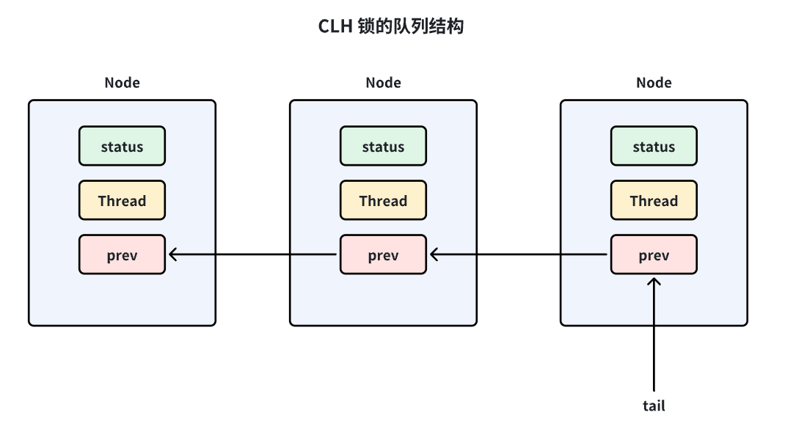
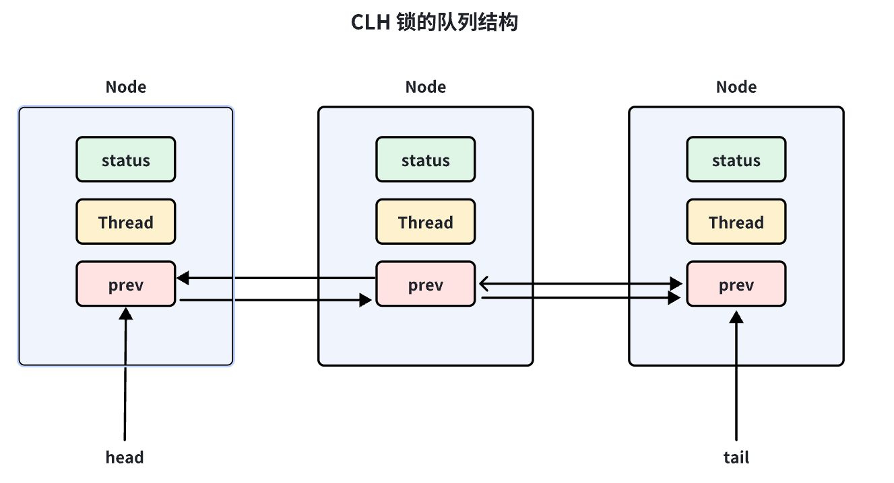

### 什么是AQS?
**AQS (AbstractQueuedSynchronizer)** 是 Java 并发包 (`java.util.concurrent`) 的核心基石。可以说，如果你掌握了 AQS，就掌握了 JUC 包的半壁江山。
简单来说，AQS 是一个用来构建锁和同步器的**框架**。像我们熟知的 `ReentrantLock`、`Semaphore`、`CountDownLatch`、`CyclicBarrier` 等，底层都是基于 AQS 实现的。
以下是我对 AQS 的核心理解，主要从**设计核心、工作原理、资源共享模式、设计模式**这几个维度来阐述：

#### 1. 核心设计思想
AQS 的核心思想可以概括为：**“状态 + 队列”**。

它通过一个 `volatile int` 类型的变量（`state`）来表示资源的状态，通过一个 FIFO（先进先出）的队列（CLH 变体队列）来管理那些争抢资源失败的线程。

*   **State (资源状态):**
    *   AQS 维护了一个 `volatile int state` 变量。
    *   这个变量的具体含义由子类定义。例如：
        *   在 `ReentrantLock` 中，`state=0` 表示无锁，`state>0` 表示重入次数。
        *   在 `Semaphore` 中，`state` 表示剩余的许可证数量。
        *   在 `CountDownLatch` 中，`state` 表示倒数计数器的值。
    *   对 `state` 的修改必须通过 **CAS (Compare-And-Swap)** 操作保证原子性。

*   **CLH 队列 (线程排队):**
    *   当多个线程争用资源时，如果某个线程失败了，AQS 会把这个线程封装成一个 **Node 节点**，并插入到同步队列的尾部。
    *   这个队列是一个双向链表。
    *   AQS 负责将线程阻塞（使用 `LockSupport.park`）和唤醒（`LockSupport.unpark`）。

#### 2. 核心工作流程
我们可以把 AQS 想象成银行的一个办理窗口：

1.  **抢占资源 (Acquire):**
    *   线程 A 来办理业务，看到窗口没人（`state` 允许获取），直接修改状态（CAS），办理业务。
    *   线程 B 来了，发现窗口有人（`state` 不允许获取），它尝试修改状态失败。
2.  **进入队列:**
    *   线程 B 会被封装成一个 Node，加入到等待队列的队尾。
    *   线程 B 会自旋（Spin）检查一下前驱节点是不是头节点（Head），如果是，再试一次。如果还不行，就挂起（Park）睡觉，等待唤醒。
3.  **释放资源 (Release):**
    *   线程 A 办完业务，修改 `state` 状态，并唤醒队列头部最靠近的一个有效节点（通常是 Head 的后继节点，即线程 B）。
    *   线程 B 醒来，再次尝试获取资源。

#### 3. 两种资源共享模式
AQS 定义了两种资源访问方式，子类根据需要实现：

*   **Exclusive (独占模式):**
    *   同一时刻只有一个线程能执行。
    *   代表：`ReentrantLock`。
    *   如果资源被占用，其他线程只能入队等待。
*   **Shared (共享模式):**
    *   同一时刻可以有多个线程同时执行。
    *   代表：`Semaphore`（信号量）、`CountDownLatch`、`ReentrantReadWriteLock` 的读锁。
    *   当一个线程成功获取共享资源后，它还会尝试唤醒后面等待共享锁的节点（具有**传播性**）。

#### 4. 模版方法设计模式
AQS 是**模版方法模式 (Template Method Pattern)** 的经典应用。

AQS 作为一个抽象基类，已经把“排队”、“入队”、“出队”、“阻塞”、“唤醒”这些复杂的底层脏活累活都做好了（定义在顶层方法中，如 `acquire()`）。

子类只需要实现具体的 **“尝试获取”** 和 **“尝试释放”** 的逻辑即可。子类通常需要重写以下几个 protected 方法：

*   `tryAcquire(int arg)`: 独占方式尝试获取资源。
*   `tryRelease(int arg)`: 独占方式尝试释放资源。
*   `tryAcquireShared(int arg)`: 共享方式尝试获取资源。
*   `tryReleaseShared(int arg)`: 共享方式尝试释放资源。
*   `isHeldExclusively()`: 当前线程是否独占资源。

**举个例子：**
`ReentrantLock` 的内部类 `Sync` 继承了 AQS，它在 `tryAcquire` 里写了这样的逻辑：如果 `state` 是 0，就 CAS 把它变成 1（或更多），并记录当前线程是持有者；如果不是 0 且持有者是自己，就增加 `state`（重入）。至于如果失败了怎么办，AQS 的父类逻辑会自动帮你把线程扔进队列去排队。

#### 5. Condition 条件队列（进阶）
除了同步队列（Sync Queue），AQS 还提供了 `ConditionObject`，用来实现类似 `Object.wait()` / `notify()` 的功能。
*   它维护了一个**条件队列**（单向链表）。
*   当调用 `await()` 时，线程会释放锁，封装成 Node 进入条件队列等待。
*   当调用 `signal()` 时，节点会从条件队列转移到同步队列，等待再次竞争锁。

#### 总结
我对 AQS 的理解总结为：
AQS 是 Java 并发的**发动机**。它利用 **volatile 修饰的 state** 变量作为共享资源标识，利用 **CAS** 指令保证原子性，利用 **CLH 双向队列** 管理等待线程，并通过 **LockSupport** 实现线程的阻塞唤醒。它通过**模版方法模式**屏蔽了复杂的同步状态管理和队列维护逻辑，让开发者只需关注业务层面的资源获取与释放逻辑。

### AQS 为什么使用 CLH 锁队列的变体？
AQS 之所以选择 CLH 队列（Craig, Landin, and Hagersten locks）的**变体**，而不是使用原始的 CLH 或者 MCS 队列，也不是简单的 LinkedList，是因为它需要在**性能、可扩展性**以及**功能需求**（如支持阻塞、超时、取消）之间找到最佳平衡。

原始的 CLH 锁是一种**基于链表的自旋锁**，通常用于解决多核 CPU 下的缓存一致性流量问题。AQS 在此基础上做了重大改良，主要原因如下：

#### 1. 从“纯自旋”到“阻塞唤醒”的转变
*   **原始 CLH 的局限：** 原始 CLH 是为**自旋锁**设计的。后一个节点不断自旋（死循环检查）前一个节点的状态。如果锁持有时间很短，这很高效；但如果锁被长时间持有，自旋会白白消耗大量 CPU 资源。
*   **AQS 的需求：** Java 的锁（如 `ReentrantLock`）通常是**阻塞锁**。当线程竞争失败时，不能一直自旋，而是需要挂起（Park）以释放 CPU 给其他线程。
*   **AQS 的变体：** 为了支持阻塞和唤醒，AQS 必须让前驱节点在释放锁时，能够**主动唤醒**后继节点。 因此，AQS 的节点（Node）不仅仅需要知道“前驱是谁”（用于判断状态），还需要知道 **“后继是谁”**（用于唤醒它）。所以 AQS 在 CLH 的单向链表基础上，增加了 `next` 指针，变成了**双向链表**。

#### 2. 处理“超时”与“取消” (Cancelling)
*   **原始 CLH 的局限：** 原始算法假设所有线程都会坚定地排队直到拿到锁，不考虑中途退出的情况。
*   **AQS 的需求：** 很多并发场景需要支持 `tryLock(timeout)` 或者响应中断。这意味着队列中的某个节点可能会在中间“消失”或“取消”。
*   **AQS 的变体：** 引入 `prev` 指针和 `waitStatus`。
    *   当一个节点取消时，它变成无效节点。
    *   依靠双向链表的 `prev` 指针，AQS 可以方便地处理链表的**断链和重连**，跳过那些已经取消（CANCELLED）的节点，找到有效的等待节点。

#### 3. `next` 指针的不可靠性与从尾部遍历
这是一个非常经典的 AQS 面试细节。
*   **问题：** 在 AQS 中，节点入队是并发操作。虽然入队是通过 CAS 操作 `tail` 指针来保证原子性的，但链表的链接（设置 `prev` 和 `next`）不是瞬间完成的。
    *   具体的入队逻辑是：先设置 `current.prev = tail`，然后 CAS 更新 `tail`，**最后**才设置 `oldTail.next = current`。
*   **结果：** 这导致在某些时刻，从 head 往后遍历（通过 `next`）可能会断掉（`next` 还是 null），但从 tail 往前遍历（通过 `prev`）是一定完整的。
*   **AQS 的变体：** 正因为原始 CLH 不需要显式的 `next` 指针，而 AQS 需要依靠 `next` 唤醒后续线程。为了弥补 `next` 指针在并发插入时的暂时不一致性，AQS 在唤醒线程时，如果发现 `next` 节点是 null 或者已取消，会选择**从 tail 向前遍历**（利用可靠的 `prev` 指针）来找到最靠前的有效节点进行唤醒。

#### 4. 状态封装 (waitStatus)
*   **原始 CLH：** 通常只需要检查前驱的一个布尔值（locked/unlocked）。
*   **AQS 的变体：** 引入了 `waitStatus` 整数变量。
    *   因为它不仅仅要表示“锁被占用”，还需要表示更复杂的状态：
        *   `SIGNAL (-1)`: 表示后继节点被挂起了，我释放锁后必须唤醒它。
        *   `CANCELLED (1)`: 线程取消了。
        *   `CONDITION (-2)`: 线程在条件队列中。
        *   `PROPAGATE (-3)`: 共享锁模式下的传播特性。
    *   这种状态机制让前驱节点承担了“通知”的责任，而不是让后继节点单纯地“轮询”。

#### 总结
AQS 使用 CLH 变体的核心原因在于：**它不仅仅需要一个排队机制（FIFO），更需要一个能够支持“阻塞/唤醒”机制、能够处理“节点取消”、并且在并发高竞争下依然健壮的结构。**

*   **保留了 CLH 的优点：** FIFO 保证公平性、无饥饿；基于前驱节点的自旋（在入队初期短暂自旋）减少了总线竞争。
*   **改进了 CLH 的缺点：** 通过**双向链表**和**waitStatus**，实现了被动阻塞（Park）和主动唤醒（Unpark），以及灵活的中断处理。

### AQS核心思想
AQS 核心思想是，如果被请求的共享资源空闲，则将当前请求资源的线程设置为有效的工作线程，并且将共享资源设置为锁定状态。
如果被请求的共享资源被占用，那么就需要一套线程阻塞等待以及被唤醒时锁分配的机制，这个机制 AQS 是基于 **CLH** 锁 （Craig, Landin, and Hagersten locks） 进一步优化实现的。

**CLH** 锁 对自旋锁进行了改进，是基于单链表的自旋锁。在多线程场景下，会将请求获取锁的线程组织成一个单向队列，每个等待的线程会通过自旋访问前一个线程节点的状态， 前一个节点释放锁之后，当前节点才可以获取锁。**CLH** 锁 的队列结构如下图所示。

AQS 中使用的 等待队列 是 CLH 锁队列的变体（接下来简称为 CLH 变体队列）。
AQS 的 CLH 变体队列是一个双向队列，会暂时获取不到锁的线程将被加入到该队列中，CLH 变体队列和原本的 CLH 锁队列的区别主要有两点：
* 由 **自旋** 优化为 **自旋 + 阻塞** ：自旋操作的性能很高，但大量的自旋操作比较占用 CPU 资源，因此在 CLH 变体队列中会先通过自旋尝试获取锁，如果失败再进行阻塞等待。
* 由 **单向队列** 优化为 **双向队列** ：在 CLH 变体队列中，会对等待的线程进行阻塞操作，当队列前边的线程释放锁之后，需要对后边的线程进行唤醒，因此增加了 `next` 指针，成为了双向队列。

AQS 将每条请求共享资源的线程封装成一个 CLH 变体队列的一个结点（Node）来实现锁的分配。在 CLH 变体队列中，一个节点表示一个线程， 它保存着线程的引用（thread）、 当前节点在队列中的状态（waitStatus）、前驱节点（prev）、后继节点（next）。

AQS 中的 CLH 变体队列结构如下图所示：


AQS（AbstractQueuedSynchronizer）的核心思想可以用一句话概括：

**“使用一个 `volatile` 修饰的 `int` 类型变量表示同步状态，并维护一个 FIFO（先进先出）的等待队列来管理竞争资源失败的线程。”**

如果要进一步拆解，AQS 的核心思想主要体现在以下 **3 个维度**：

#### 1. 状态管理（State）：定义资源的“有无”
AQS 不直接操作具体的业务数据，而是抽象出一个整数 `state` 来代表“资源”。
```JAVA
private volatile int state; // 共享变量，使用volatile修饰保证线程可见性
```

另外，状态信息 state 可以通过 protected 类型的getState()、setState()和compareAndSetState() 进行操作。并且，这几个方法都是 final 修饰的，在子类中无法被重写。
```JAVA
// 返回同步状态的当前值
protected final int getState() {
    return state;
}

// 设置同步状态的值
protected final void setState(int newState) {
    state = newState;
}

// 原子地（CAS操作）将同步状态值设置为给定值update如果当前同步状态的值等于expect（期望值）
protected final boolean compareAndSetState(int expect, int update) {
    return unsafe.compareAndSwapInt(this, stateOffset, expect, update);
}
```
*   **核心变量：** `volatile int state`。
*   **核心逻辑：**
    *   `state` 的具体含义由子类决定。
    *   **ReentrantLock**：`state=0` 代表空闲，`state=1` 代表被占用，`state>1` 代表重入次数。
    *   **Semaphore**：`state` 代表剩余许可证的数量。
    *   **CountDownLatch**：`state` 代表还需要倒数的次数。
*   **操作方式：** 使用 **CAS (Compare-And-Swap)** 乐观锁指令来保证对 `state` 修改的原子性，避免使用重量级的 synchronized 锁。

#### 2. 队列管理（CLH Variant）：管理线程的“排队”
当线程尝试修改 `state` 失败（即抢不到锁）时，AQS 必须有一个机制让这些线程“乖乖排队”，并且在适当的时候“睡去”和“醒来”。

*   **核心结构：** CLH 锁队列的变体（双向链表）。
*   **核心逻辑：**
    *   **封装：** 将线程封装成 `Node` 节点，包含线程引用、等待状态（`waitStatus`）、前驱后继指针。
    *   **入队：** 抢锁失败的线程，通过 CAS 操作插入队尾。
    *   **阻塞：** 既然抢不到，就调用 `LockSupport.park()` 让线程挂起（阻塞），不再占用 CPU 空转（除非是在入队初期的短时自旋）。
    *   **唤醒：** 持有锁的线程释放资源后，修改 `state`，并调用 `LockSupport.unpark()` 唤醒队列头部节点的线程。

#### 3. 设计模式：模版方法（Template Method）
AQS 的设计哲学是将**“通用的排队阻塞机制”**与**“具体的抢锁业务逻辑”**剥离。

*   **AQS 做的事（通用）：** 怎么入队、怎么出队、怎么阻塞线程、怎么唤醒线程、怎么处理中断。这些最复杂、最容易出错的底层逻辑，AQS 全包了。
*   **子类做的事（具体）：** 仅仅需要实现 `tryAcquire`（怎么才算抢到锁）和 `tryRelease`（怎么才算释放锁）这两个方法。

---

#### 总结
AQS 的核心思想就是 **“CAS 修改状态 + 自旋/阻塞机制 + FIFO 队列”** 的完美组合。

*   它用 **State** 解决了“资源现在是谁的”的问题。
*   它用 **Queue** 解决了“抢不到资源的线程去哪儿”的问题。
*   它用 **Template Pattern** 解决了“如何复用代码构建不同类型同步器”的问题。