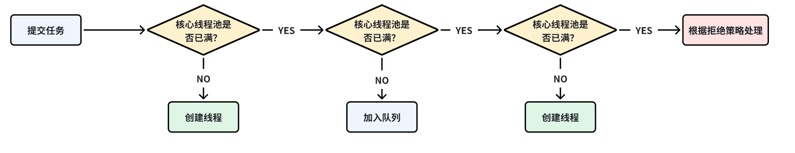

## 什么是线程池

在Java中，线程池是一种基于池化思想管理和复用线程的并发框架。它的核心价值在于通过预先创建一组线程并统一管理，避免为每个任务都频繁地创建和销毁线程，从而显著提升系统性能和资源利用效率。
使用线程池的主要优势在于：

1. **降低资源消耗（Resource Reduction）**：通过重用已存在的线程，而不是每次需要时都创建和销毁新线程，避免了线程创建和销毁所带来的性能开销。
2. **提高响应速度（Improved Responsiveness）**：当任务到达时，工作线程已经存在，可以直接执行，无需等待线程创建的时间。
3. **提高可管理性（Enhanced Manageability）**：线程池可以对线程进行统一分配、调优和监控，避免了系统因创建过多线程而导致资源耗尽的风险。

## 如何创建线程池

在Java中创建线程池主要有两种方式：

1. **使用 `Executors` 工厂类**：快速创建常见的、预配置的线程池。
2. **直接构造 `ThreadPoolExecutor`**：自定义所有参数，创建最灵活、最高效的线程池（**推荐**）。

下面详细解释这两种方式。

-----

### 方式一：使用 `Executors` 工厂类

`java.util.concurrent.Executors` 类提供了一系列静态工厂方法，可以快速创建几种预定义配置的线程池。

#### 1\. 固定大小线程池 (`FixedThreadPool`)

创建一个线程数量固定的线程池。该线程池中的线程数量始终不变。当有一个新的任务提交时，线程池中若有空闲线程，则立即执行。若没有，则新的任务会被暂存在一个任务队列中，待有线程空闲时，便处理在任务队列中的任务。

```java
import java.util.concurrent.ExecutorService;
import java.util.concurrent.Executors;

// 创建一个固定大小为 5 的线程池
ExecutorService fixedThreadPool = Executors.newFixedThreadPool(5);

// 提交任务
for (int i = 0; i < 10; i++) {
    fixedThreadPool.execute(() -> {
        System.out.println(Thread.currentThread().getName() + " 正在执行任务...");
    });
}

// 关闭线程池
fixedThreadPool.shutdown();
```

#### 2\. 可缓存线程池 (`CachedThreadPool`)

创建一个会根据需要创建新线程的线程池。如果线程空闲时间超过 60 秒，则会被回收。

```java
import java.util.concurrent.ExecutorService;
import java.util.concurrent.Executors;

// 创建一个可缓存的线程池
ExecutorService cachedThreadPool = Executors.newCachedThreadPool();

// 提交任务
// 如果任务量大且并发高，它会创建很多线程来处理。
for (int i = 0; i < 20; i++) {
    cachedThreadPool.execute(() -> {
        System.out.println(Thread.currentThread().getName() + " 正在执行任务...");
    });
}

cachedThreadPool.shutdown();
```

#### 3\. 单线程化执行器 (`SingleThreadExecutor`)

创建一个只有一个工作线程的线程池，确保所有任务都在一个线程中按顺序执行。若多于一个任务被提交到该线程池，任务会被保存在一个任务队列中，待线程空闲，按先入先出的顺序执行队列中的任务。

```java
import java.util.concurrent.ExecutorService;
import java.util.concurrent.Executors;

// 创建一个单线程执行器
ExecutorService singleExecutor = Executors.newSingleThreadExecutor();

// 提交任务
for (int i = 0; i < 5; i++) {
    singleExecutor.execute(() -> {
        System.out.println(Thread.currentThread().getName() + " 正在执行任务: " + i);
    });
}

singleExecutor.shutdown();
```

#### 4\. 定时任务线程池 (`ScheduledThreadPool`)

创建一个支持定时及周期性任务执行的线程池。

```java
import java.util.concurrent.ScheduledExecutorService;
import java.util.concurrent.Executors;
import java.util.concurrent.TimeUnit;

// 创建一个大小为 3 的定时任务线程池
ScheduledExecutorService scheduledThreadPool = Executors.newScheduledThreadPool(3);

// 提交一个 3 秒后执行一次的任务
scheduledThreadPool.schedule(() -> {
    System.out.println("定时任务执行!");
}, 3, TimeUnit.SECONDS);

// 提交一个延迟 1 秒后开始，每隔 2 秒执行一次的任务
scheduledThreadPool.scheduleAtFixedRate(() -> {
    System.out.println("周期性任务执行!");
}, 1, 2, TimeUnit.SECONDS);

// 注意：通常需要更复杂的逻辑来关闭定时线程池，以保证任务执行完毕。
// scheduledThreadPool.shutdown(); 
```

-----

### 方式二：直接构造 `ThreadPoolExecutor` (推荐)

在生产环境中，**《阿里巴巴 Java 开发手册》** 等规范**不建议**使用 `Executors` 创建线程池，因为它们的默认配置（特别是
`newCachedThreadPool` 和 `newFixedThreadPool`）可能会导致**资源耗尽**（如 OOM）。

最安全和最推荐的方式是直接使用 `ThreadPoolExecutor` 的构造函数，并明确定义其参数。

#### `ThreadPoolExecutor` 构造函数签名

```java
public ThreadPoolExecutor(
    int corePoolSize,          // 核心线程数
    int maximumPoolSize,       // 最大线程数
    long keepAliveTime,        // 非核心线程存活时间
    TimeUnit unit,             // 存活时间单位
    BlockingQueue<Runnable> workQueue, // 任务队列
    ThreadFactory threadFactory,       // 线程工厂
    RejectedExecutionHandler handler   // 拒绝策略
) 
```

#### 关键参数详解

| 参数名称                       | 描述                                          | 最佳实践参考值                                                       |
|:---------------------------|:--------------------------------------------|:--------------------------------------------------------------|
| `corePoolSize`             | **核心线程数**。即使空闲，也会保留的线程数。                    | CPU 密集型：`N + 1`；IO 密集型：`2N` 到 `3N` (N为CPU核心数)。                |
| `maximumPoolSize`          | **最大线程数**。池中允许的最大线程数。                       | 取决于系统负载和任务队列长度。                                               |
| `keepAliveTime`            | **存活时间**。当线程数大于核心线程数时，多余空闲线程在终止前等待新任务的最长时间。 | 常用值：`60L` 秒。                                                  |
| `workQueue`                | **任务队列**。用于保存等待执行的 `Runnable` 任务的阻塞队列。      | 常用：`LinkedBlockingQueue` (无界/有界) 或 `ArrayBlockingQueue` (有界)。 |
| `RejectedExecutionHandler` | **拒绝策略**。当任务队列已满且线程数达到最大值时，如何处理新提交的任务。      | 常用：`CallerRunsPolicy` (调用者运行任务)。                              |

#### 示例代码：自定义线程池

假设服务器有 8 个 CPU 核心，任务为 IO 密集型，我们设置核心线程为 16。

```java
import java.util.concurrent.*;

public class CustomThreadPool {
    public static void main(String[] args) {
        // 核心线程数: 16 (假设 IO 密集型，CPU 核心数 * 2)
        int corePoolSize = 16; 
        // 最大线程数: 50
        int maximumPoolSize = 50; 
        // 存活时间: 60 秒
        long keepAliveTime = 60L; 
        
        // 任务队列: 使用一个容量为 1000 的有界队列
        BlockingQueue<Runnable> workQueue = new ArrayBlockingQueue<>(1000);
        
        // 拒绝策略: 使用调用者运行策略
        RejectedExecutionHandler handler = new ThreadPoolExecutor.CallerRunsPolicy(); 
        
        // 线程工厂: 默认即可，也可以自定义用于命名线程
        ThreadFactory threadFactory = Executors.defaultThreadFactory();

        // 构造 ThreadPoolExecutor
        ThreadPoolExecutor executor = new ThreadPoolExecutor(
            corePoolSize,
            maximumPoolSize,
            keepAliveTime,
            TimeUnit.SECONDS,
            workQueue,
            threadFactory,
            handler
        );

        // 提交任务
        for (int i = 0; i < 1010; i++) { // 1010 个任务
            final int taskIndex = i;
            executor.execute(() -> {
                System.out.println("任务 " + taskIndex + " 被 " + Thread.currentThread().getName() + " 执行");
                try {
                    Thread.sleep(10); // 模拟 IO 操作
                } catch (InterruptedException e) {
                    Thread.currentThread().interrupt();
                }
            });
        }
        
        // 关闭线程池
        executor.shutdown();
    }
}
```

#### 总结

创建线程池的最佳实践是：**手动构造 `ThreadPoolExecutor`，并根据你的应用是 CPU 密集型还是 IO 密集型，合理设置 `corePoolSize`
和 `maximumPoolSize`，并选择合适的任务队列和拒绝策略。** 这样才能最大限度地发挥线程池的性能和安全性。

## 为什么不推荐使用 Executors 创建线程池？

Executors 返回线程池对象的弊端如下：

* `FixedThreadPool` 和 `SingleThreadExecutor`：使用的是阻塞队列`LinkedBlockingQueue`，任务队列最大长度为
  `Integer.MAX_VALUE`，可以看作是无界的，可能堆积大量的请求，从而导致 OOM。
* `CachedThreadPool`：使用的是同步队列 `SynchronousQueue`, 允许创建的线程数量为 `Integer.MAX_VALUE`
  ，如果任务数量过多且执行速度较慢，可能会创建大量的线程，从而导致 OOM。
* `ScheduledThreadPool` 和 `SingleThreadScheduledExecutor`：使用的无界的延迟阻塞队列`DelayedWorkQueue`，任务队列最大长度为
  `Integer.MAX_VALUE`，可能堆积大量的请求，从而导致 OOM。

```JAVA
public static ExecutorService newFixedThreadPool(int nThreads) {
    // LinkedBlockingQueue 的默认长度为 Integer.MAX_VALUE，可以看作是无界的
    return new ThreadPoolExecutor(nThreads, nThreads, 0L, TimeUnit.MILLISECONDS, new LinkedBlockingQueue<Runnable>());
}

public static ExecutorService newSingleThreadExecutor() {
    // LinkedBlockingQueue 的默认长度为 Integer.MAX_VALUE，可以看作是无界的
    return new FinalizableDelegatedExecutorService (new ThreadPoolExecutor(1, 1, 0L, TimeUnit.MILLISECONDS, new LinkedBlockingQueue<Runnable>()));
}

// 同步队列 SynchronousQueue，没有容量，最大线程数是 Integer.MAX_VALUE`
public static ExecutorService newCachedThreadPool() {
    return new ThreadPoolExecutor(0, Integer.MAX_VALUE, 60L, TimeUnit.SECONDS, new SynchronousQueue<Runnable>());
}

// DelayedWorkQueue（延迟阻塞队列）
public static ScheduledExecutorService newScheduledThreadPool(int corePoolSize) {
    return new ScheduledThreadPoolExecutor(corePoolSize);
}
public ScheduledThreadPoolExecutor(int corePoolSize) {
    super(corePoolSize, Integer.MAX_VALUE, 0, NANOSECONDS,
          new DelayedWorkQueue());
}
```

## 线程池的核心线程会被回收吗？

默认情况下，核心线程不会被回收。 但是，可以通过一个特定的配置来允许回收它们。关键在于一个名为 `allowCoreThreadTimeOut`
的参数，它控制着核心线程的回收行为。

下面这个表格清晰地展示了核心线程在不同配置下的回收情况。

| 配置状态                                            | 核心线程是否会被回收？ | 关键条件与说明                                                |
|:------------------------------------------------|:------------|:-------------------------------------------------------|
| **默认情况** (`allowCoreThreadTimeOut` 为 `false`)   | **不会**      | 核心线程一旦创建，即使长时间空闲，也会一直存活。这是为了减少线程频繁创建和销毁的开销，符合线程池的设计初衷。 |
| **显式开启超时** (`allowCoreThreadTimeOut` 设为 `true`) | **会**       | 当核心线程的空闲时间超过 `keepAliveTime` 所设定的值时，它就会被回收。            |

### 核心线程回收的底层原理

线程池中的每个工作线程（`Worker`）在一个循环中不断地通过 `getTask()` 方法从任务队列里获取新任务。这个方法是决定线程是否被回收的核心：

- **当 `allowCoreThreadTimeOut` 为 `true`**，或者**当前线程数大于 `corePoolSize`**（即该线程是非核心线程）时，线程会调用
  `workQueue.poll(keepAliveTime, unit)` 来获取任务。这个方法只会等待一段指定的超时时间（即 `keepAliveTime`）。
- 如果在 `keepAliveTime` 时间内没有获取到新任务，`poll` 方法会返回 `null`。接着，`getTask()` 方法也会返回 `null`
  ，这会导致工作线程退出循环，最终该线程会被终止并从线程池中移除。

简单来说，**线程是在不断尝试“领取”新任务的过程中，因为“等待超时”而被判定为可回收的**。

### 其他回收线程池的方式

除了核心线程超时，还有两种更直接的方法可以回收线程池中的所有线程：

1. **显式关闭线程池**：这是最常用和推荐的方法。
    - **`shutdown()`**：温和关闭。线程池不再接受新任务，但会等待所有已提交的任务（包括正在执行的和在队列中等待的）执行完毕后再关闭。
    - **`shutdownNow()`**：立即关闭。它会尝试中断所有正在执行的任务，并清空工作队列，返回所有未开始执行的任务列表。

2. **利用垃圾回收**：如果线程池对象在程序中已经没有任何引用，并且池中没有任何剩余线程，它将会被自动关闭。
   **但请注意，这是一种被动的、不可靠的方式，强烈不推荐依赖于它来释放资源**，因为核心线程的长时间存活会阻止线程池被回收，容易导致资源泄漏。

### 如何设置与最佳实践

- **如何开启核心线程回收**：
    ```java
    ThreadPoolExecutor executor = new ThreadPoolExecutor(
        5, // corePoolSize
        10, // maximumPoolSize
        30L, // keepAliveTime
        TimeUnit.SECONDS, // unit
        new LinkedBlockingQueue<>(100) // workQueue
    );
    // 允许核心线程在空闲30秒后超时回收
    executor.allowCoreThreadTimeOut(true);
    ```

一旦你调用了`allowCoreThreadTimeOut(true)`，线程池的行为将发生改变：

* **所有线程**（包括核心线程）都会遵守`keepAliveTime`的限制。

* 如果核心线程在`keepAliveTime`定义的时间内没有新任务到来，它就会被终止。

* 在这种配置下，线程池最终可能缩减到**零线程**，直到下一个任务提交时才重新创建。

## 核心线程空闲时处于什么状态？

当线程池中的**核心线程**空闲时，它并不会被销毁，而是处于 **等待 (WAITING)** 或 **有时限的等待 (TIMED\_WAITING)** 状态。

---

### 核心线程的空闲状态详解

#### 1. 默认情况：处于 **WAITING (等待)** 状态

线程池的工作线程（无论是核心还是非核心）在执行完一个任务后，会进入一个循环，试图从任务队列 (`workQueue`) 中获取下一个任务。

对于默认设置下的核心线程（即没有设置 `allowCoreThreadTimeOut(true)`）：

* 线程会调用任务队列的**无限期阻塞方法**，例如：`workQueue.take()`。
* 当队列为空时，`take()` 方法会使当前线程进入 **WAITING** 状态，并释放其持有的 CPU 资源。
* 这个线程会一直挂起，**直到**任务队列中有一个新的任务被提交进来。一旦有新任务，`take()` 方法返回，线程被唤醒，状态变为
  `RUNNABLE`，并开始执行任务。

#### 2. 特殊配置：处于 **TIMED\_WAITING (有时限的等待)** 状态

正如我们之前讨论的，如果你调用了 `executor.allowCoreThreadTimeOut(true)` 来允许核心线程超时：

* 此时，线程会调用任务队列的**有时限阻塞方法**，例如：`workQueue.poll(keepAliveTime, unit)`。
* 当队列为空时，线程会进入 **TIMED\_WAITING** 状态，等待指定的时间 (`keepAliveTime`)。
* **如果**在等待时间内有新任务到来，线程被唤醒，状态变为 `RUNNABLE`。
* **如果**等待时间超时，但队列仍然为空，`poll()` 方法返回 `null`，工作线程会判断自己已经空闲超时，并正常退出，从而被回收。

---

### 总结

| 线程状态               | 触发条件                                            | 实际行为                                         |
|:-------------------|:------------------------------------------------|:---------------------------------------------|
| **WAITING**        | 核心线程空闲，且**未设置**超时回收。                            | 线程调用 `take()` 方法无限期等待新任务。                    |
| **TIMED\_WAITING** | 核心线程空闲，且**已设置** `allowCoreThreadTimeOut(true)`。 | 线程调用 `poll(keepAliveTime, unit)` 方法有时限等待新任务。 |
| **RUNNABLE**       | 队列中有任务，线程正在执行任务或准备执行。                           | 线程被唤醒，占用 CPU 资源执行任务。                         |

所以，核心线程空闲时，它处于**被动等待**的状态，并不会消耗 CPU 资源（除了等待唤醒的开销），但会持续占用其对应的**内存资源**。

## 线程池的拒绝策略有哪些？

线程池的拒绝策略（`RejectedExecutionHandler`）是在以下两种情况同时发生时被触发的：

1. 线程池中的线程数量已经达到了**最大线程数**（`maximumPoolSize`）。
2. 任务队列（`workQueue`）也已经**满了**。

此时，如果再有新的任务提交给线程池，线程池就会根据设置的拒绝策略进行处理。Java 提供了四种标准的拒绝策略，它们都是
`ThreadPoolExecutor` 的内部静态类：

---

下表详细说明了这些策略及其适用场景，帮助你快速理解和选择。

| 拒绝策略                    | 行为描述                                  | 适用场景                                       | 注意事项                                  |
|:------------------------|:--------------------------------------|:-------------------------------------------|:--------------------------------------|
| **AbortPolicy**         | 直接抛出 `RejectedExecutionException` 异常。 | **默认策略**。适用于需要明确知道任务提交失败，并能通过捕获异常进行处理的场景。  | 必须妥善处理异常，否则会中断当前执行流程。                 |
| **CallerRunsPolicy**    | 将被拒绝的任务退回给**调用者线程**执行。                | 需要保证所有任务都不被丢弃的场景。能自动减缓新任务提交速度，是一种简单的负反馈机制。 | 若任务提交速度持续过快，可能导致调用者线程（如主线程）阻塞，影响整体响应。 |
| **DiscardPolicy**       | 默默**丢弃**被拒绝的任务，**不抛出任何异常或通知**。        | 适用于对任务丢失不敏感的场景，例如一些可丢弃的日志记录或统计信息收集任务。      | 任务被静默丢弃，问题难以排查，需谨慎使用。                 |
| **DiscardOldestPolicy** | 丢弃**任务队列中最旧**的未执行任务，然后尝试重新提交当前被拒绝的任务。 | 适用于处理最新消息比旧消息更重要的场景，如实时消息更新。               | 会丢弃一个正在等待的任务，可能造成数据或逻辑不一致。            |

#### 如何选择与自定义策略

选择拒绝策略时，核心是评估你的业务需求：

- **是否需要绝对保证任务被执行？** 是 → 考虑 `CallerRunsPolicy`。
- **是否能接受任务失败，但需要明确知道？** 是 → 使用默认的 `AbortPolicy` 并做好异常处理。
- **任务是否可丢弃？** 是 → 根据时效性选择 `DiscardPolicy` 或 `DiscardOldestPolicy`。

如果内置策略都无法满足你的复杂需求（例如，需要记录日志、将任务暂存到数据库、或触发告警等），你可以实现
`RejectedExecutionHandler` 接口来自定义拒绝策略。

```java
// 示例：一个简单的自定义拒绝策略，记录日志后再丢弃任务
public class LogDiscardPolicy implements RejectedExecutionHandler {
    @Override
    public void rejectedExecution(Runnable r, ThreadPoolExecutor executor) {
        // 自定义处理逻辑，比如记录日志或通知管理员
        System.out.println("Task " + r.toString() + " was rejected and will be discarded.");
        // 这里可以扩展为发送告警邮件、短信等
    }
}

// 在线程池中使用自定义拒绝处理器
ThreadPoolExecutor executor = new ThreadPoolExecutor(
    corePoolSize, maximumPoolSize, keepAliveTime, TimeUnit.SECONDS,
    workQueue,
    new LogDiscardPolicy() // 使用自定义策略
);
```

#### 触发拒绝策略的时机

需要明确的是，拒绝策略并非在线程数达到 `maximumPoolSize` 时立即触发。准确地说，当同时满足以下两个条件时，新提交的任务才会触发拒绝策略：

1. **当前运行的线程数已经等于 `maximumPoolSize`**。
2. **任务队列（`workQueue`）已满**。

## 线程池常用的阻塞队列有哪些？

Java线程池中，阻塞队列（Blocking Queue）作为任务的“等候区”，其选择直接影响线程池的行为和性能。下面这个表格汇总了最常用的几种阻塞队列及其核心特性。

| 队列类型                      | 数据结构    | 是否有界     | 特点                    | 典型应用场景                                       |
|:--------------------------|:--------|:---------|:----------------------|:---------------------------------------------|
| **ArrayBlockingQueue**    | 数组      | **有界**   | 顺序FIFO，单锁（读写共用）       | 固定大小缓冲池，任务量可控                                |
| **LinkedBlockingQueue**   | 链表      | 可选（默认无界） | 顺序FIFO，双锁（读写分离）       | 处理突发流量，`Executors.newFixedThreadPool()` 默认使用 |
| **SynchronousQueue**      | 无缓冲     | **无容量**  | 直接移交，不存储任务            | 高并发短任务，`Executors.newCachedThreadPool()` 使用  |
| **PriorityBlockingQueue** | 堆（数组）   | **无界**   | 按优先级排序                | 需要按优先级处理任务的系统                                |
| **DelayQueue**            | 基于优先级队列 | **无界**   | 延时获取，元素需实现`Delayed`接口 | 定时任务、缓存过期                                    |

#### 核心队列深度解析

- **ArrayBlockingQueue vs. LinkedBlockingQueue**：虽然都遵循FIFO，但内部实现差异导致性能特性不同。`ArrayBlockingQueue` 使用
  **单一把锁**管理入队和出队操作，实现相对简单。而 `LinkedBlockingQueue` 采用了**分离的锁**（`putLock` 和 `takeLock`
  ），使得生产者和线程可以更高程度地并行操作，这在并发高的场景下通常能带来更高的吞吐量。需要注意的是，`LinkedBlockingQueue`
  在构造时不指定容量则默认为无界队列（`Integer.MAX_VALUE`），存在任务堆积导致内存溢出（OOM）的风险。

- **SynchronousQueue 的“手递手”模式**：这是一个非常特殊的队列，它**内部没有容量**
  ，不缓存任何任务。每个插入操作（put）必须等待一个对应的移除操作（take），反之亦然。这相当于将任务直接从生产者“移交”给消费者线程。使用它意味着线程池在核心线程繁忙时，会优先创建新线程（如果未达到最大值）来处理任务，而不是将任务排队。这使得它适用于希望快速响应并执行大量短期异步任务的场景，但也要警惕任务提交过快可能导致线程数激增的风险。

- **PriorityBlockingQueue 与 DelayQueue**：这两者都基于**优先级**来管理任务。`PriorityBlockingQueue`
  是一个无界队列，任务会根据其自然顺序或提供的 `Comparator` 进行排序，总是优先级最高的任务先出队。`DelayQueue` 则是在此基础上增加了
  **延迟**机制，它封装了一个 `PriorityBlockingQueue`，其中的元素必须实现 `Delayed` 接口。只有当元素的延迟时间到期时，才能被取出执行，否则获取线程会等待。这使得
  `DelayQueue` 非常适合调度定时任务或需要延迟执行的任务。

#### 如何选择合适的队列

选择哪个队列，很大程度上取决于你的任务特性和性能要求：

- **追求高吞吐和缓冲能力**：对于任务到达不均匀，但希望平滑处理、避免丢失的场景，**`LinkedBlockingQueue`（设置有界容量）**
  是一个稳健的选择。
- **追求即时响应和无排队延迟**：对于执行时间很短、希望尽快分配线程执行的场景，可以考虑 **`SynchronousQueue`**
  。这通常要求线程池的最大线程数设置得足够大。
- **任务有明确的优先级**：当任务重要性不同，需要优先处理高优先级任务时，应使用 **`PriorityBlockingQueue`**。
- **需要执行定时或延迟任务**：对于需要在特定时间点或延迟一段时间后执行的任务，**`DelayQueue`** 是专为此设计的。通常通过
  `ScheduledThreadPoolExecutor` 来使用它会更方便。
- **简单的固定大小缓冲**：如果需要一个简单、可预测的有界队列，**`ArrayBlockingQueue`** 是不错的选择。

> **重要提示**：在生产环境中，强烈建议使用**有界队列**（如 `ArrayBlockingQueue` 或有界的 `LinkedBlockingQueue`），并结合合适的
**拒绝策略**（RejectedExecutionHandler）。这可以防止任务无限堆积导致内存溢出（OOM），从而提高系统的稳定性。

## 线程池处理任务的流程


当调用 `threadPool.execute(task)` 提交一个新任务时，`ThreadPoolExecutor` 会按照一套严格的**四步流程**来决定如何处理这个任务。

这是面试中非常高频的考点，可以将其总结为：**“先核心，后队列，再最大，最后拒绝”**。

我们可以把这个流程想象成一个漏斗：

1. **核心池 (Core Pool)**：是否还有空位？
2. **阻塞队列 (Work Queue)**：是否还能排队？
3. **最大池 (Max Pool)**：是否还能扩容？
4. **拒绝策略 (Reject)**：无法处理，抛弃或降级。

---

#### 详细步骤解析

##### 第一步：判断核心线程数 (`corePoolSize`)

* **逻辑**：检查当前正在运行的线程数量是否小于 `corePoolSize`。
* **结果**：
    * **是 (< corePoolSize)**：线程池会**创建一个新的核心线程**，并立即执行这个新提交的任务（即使此时有其他空闲的核心线程，也可能会创建新线程，直到达到核心数）。
    * **否 (>= corePoolSize)**：核心线程已满，进入第二步。

##### 第二步：判断任务队列 (`workQueue`)

* **逻辑**：核心线程都在忙，检查阻塞队列是否已满。
* **结果**：
    * **未满**：将任务**放入阻塞队列**中等待。一旦核心线程空闲下来，它们会从队列中取出任务执行。
    * **已满**：任务无法入队，进入第三步。

##### 第三步：判断最大线程数 (`maximumPoolSize`)

* **逻辑**：队列满了，检查当前运行的线程总数是否小于 `maximumPoolSize`。
* **结果**：
    * **是 (< maximumPoolSize)**：线程池会**创建一个新的非核心线程**，并**立即执行这个新提交的任务**
      （注意：它不是去执行队列里的任务，而是执行当前这个“插队”的任务）。
    * **否 (>= maximumPoolSize)**：线程池的承载能力达到极限，进入第四步。

##### 第四步：执行拒绝策略 (`RejectedExecutionHandler`)

* **逻辑**：线程数达到最大值，队列也满了，无法接受新任务。
* **结果**：根据配置的**拒绝策略**（如 `AbortPolicy` 抛出异常或 `CallerRunsPolicy` 由调用者执行）来处理这个任务。

---

#### 🏦 生活中的类比：银行办事

为了方便记忆，可以把线程池想象成一家**银行**：

1. **核心线程 = 常设窗口**
    * 你进银行办业务。如果有空闲的**常设窗口**（核心线程），或者常设窗口还没开满，银行会立刻安排一个窗口给你服务。
2. **任务队列 = 候客区椅子**
    * 如果常设窗口都在忙，你会被安排到**候客区**（队列）坐着排队。
3. **最大线程 = 临时爱心窗口**
    * 如果候客区的椅子也坐满了（队列满了），大堂经理看到还有人进来，就会临时开启**爱心窗口**（非核心线程）来处理新来的客户。
    * *注意：此时新来的客户直接去了爱心窗口，不用排队，这叫“救急不救穷”。*
4. **拒绝策略 = 关门谢客**
    * 如果常设窗口、爱心窗口都满了，候客区也坐满了，保安就会拦住新来的客户：“**今天人满了，请明天再来**（拒绝策略）”。

#### ⚠️ 重要细节

* **非核心线程何时回收？**
    * 当那些临时开启的“爱心窗口”（非核心线程）处理完当前任务，且在指定时间（`keepAliveTime`）内没有从候客区（队列）拉取到新任务时，它们就会被关闭。

## 线程池中线程异常后，销毁还是复用？

在 Java 线程池中，当一个线程执行任务时发生异常，它的命运（是被销毁还是复用）主要取决于你提交任务的方式：是使用 `execute()`
方法还是 `submit()` 方法。这两种方式在异常处理机制上有根本的不同。

下表清晰地展示了这两种方式的核心差异。

| 特性         | `execute()` 方法                               | `submit()` 方法                                              |
|:-----------|:---------------------------------------------|:-----------------------------------------------------------|
| **异常处理机制** | 异常直接抛出到线程的 `run` 方法，若未捕获，会导致线程终止。            | 异常被封装在返回的 `Future` 对象中。                                    |
| **线程命运**   | 发生未捕获异常后，该**线程会被销毁**。                        | 即使任务抛出异常，**线程也会被复用**，继续执行后续任务。                             |
| **异常感知**   | 异常会打印到控制台/日志，易于发现。                           | 异常被“吞没”，只有调用 `Future.get()` 时才会重新抛出（`ExecutionException`）。 |
| **线程池行为**  | 线程池会检测到线程终止，并**创建一个新的工作线程**来替代它，以维持线程池的线程数量。 | 由于线程未被终止，线程池**无需创建新线程**。                                   |

#### 🔍 深入理解差异根源

这种差异的根源在于底层实现机制的不同。

* **`execute()` 方法**：当你直接使用 `execute()` 提交一个 `Runnable` 任务时，如果任务中抛出了未捕获的异常，这个异常会一路向上抛，最终导致执行该任务的
  **工作线程（Worker）结束其生命循环**。线程池在清理这个退出的线程时（`processWorkerExit` 方法），如果判断线程是因异常而突然终止（
  `completedAbruptly = true`），则会**调用 `addWorker(null, false)` 来补充一个新的线程**，以保持池的预期规模
  。这就是为什么你会在日志中看到抛出异常的线程消失，并有一个新线程（如名字中的编号增加）出现的原因。

* **`submit()` 方法**：`submit()` 方法接受的实际上可以是 `Runnable` 或 `Callable`。在线程池内部，它会将你的任务包装成一个
  `FutureTask` 对象。`FutureTask` 的 `run` 方法在执行你的任务逻辑时，会**捕获所有 `Throwable` 异常**，并将其通过
  `setException(ex)` 方法保存起来。此时，线程本身并未遇到未处理的异常，因此它会正常结束本次任务执行，然后**继续从工作队列获取下一个任务**，
 从而实现复用 。你只有通过调用 `Future.get()` 才能获取到被封装的 `ExecutionException`，从而知晓任务执行过程中出了错。

具体的源码分析可以参考这篇：[线程池中线程异常后：销毁还是复用？ - 京东技术](https://mp.weixin.qq.com/s/9ODjdUU-EwQFF5PrnzOGfw)。

#### 💡 如何选择与最佳实践

了解这些机制后，你可以根据实际需求做出选择和进行优化。

1. **根据场景选择方法**：
    * 如果任务非常简单，且不需要关心执行结果，可以使用 `execute()`，但务必在任务内部做好异常处理。
    * 如果需要获取任务执行结果或希望更精细地控制异常，**优先使用 `submit()`**，并记得调用 `Future.get()` 来检查异常。

2. **主动处理异常（最佳实践）**：
   无论使用哪种方法，最稳妥的方式都是在**任务内部（`run` 方法或 `call` 方法）使用 `try-catch` 块**
   进行主动捕获和处理。这是最直接、最可控的异常处理方式 。

3. **设置全局后备方案**：
   你可以通过实现 `Thread.UncaughtExceptionHandler` 接口，并将其设置给线程池（通过自定义 `ThreadFactory`
   ），来作为一个全局的、最后的防线，捕获那些可能被漏掉的未处理异常 。

## 如何给线程池命名？

初始化线程池的时候需要显示命名（设置线程池名称前缀），有利于定位问题。默认情况下创建的线程名字类似`pool-1-thread-n`
这样的，没有业务含义，不利于我们定位问题。给线程池里的线程命名通常有下面两种方式：

1. **利用 guava 的`ThreadFactoryBuilder`**

```JAVA
ThreadFactory threadFactory = new ThreadFactoryBuilder()
                        .setNameFormat(threadNamePrefix + "-%d")
                        .setDaemon(true).build();
ExecutorService threadPool = new ThreadPoolExecutor(corePoolSize, maximumPoolSize, keepAliveTime, TimeUnit.MINUTES, workQueue, threadFactory); 
```

2. **自定义 `ThreadFactory`**

```JAVA
import java.util.concurrent.ThreadFactory;
import java.util.concurrent.atomic.AtomicInteger;

/**
 * 线程工厂，它设置线程名称，有利于我们定位问题。
 */
public final class NamingThreadFactory implements ThreadFactory {

    private final AtomicInteger threadNum = new AtomicInteger();
    private final String name;

    /**
     * 创建一个带名字的线程池生产工厂
     */
    public NamingThreadFactory(String name) {
        this.name = name;
    }

    @Override
    public Thread newThread(Runnable r) {
        Thread t = new Thread(r);
        t.setName(name + " [#" + threadNum.incrementAndGet() + "]");
        return t;
    }
}
```

## 如何合理地设置线程池的大小？

合理设置线程池的大小（即 `corePoolSize` 和 `maximumPoolSize`）是线程池性能调优中**最关键**的一步，它直接影响系统的吞吐量、响应时间和资源利用率。
线程池大小的设置没有一个“万能公式”，它主要取决于你提交给线程池执行的任务类型：是 **CPU 密集型** 还是 **I/O 密集型**。

---

### 核心原则：区分任务类型

#### 1. CPU 密集型任务 (CPU-Bound)

* **定义**：这类任务需要大量的计算，例如矩阵运算、复杂数据处理、加解密、压缩解压等。它们的特点是 CPU 占用率高，几乎没有 I/O
  等待时间。
* **目标**：充分利用 CPU 的核心，避免过多线程进行不必要的上下文切换。
* **计算公式**：

  $$\text{线程数} = \text{CPU 核心数} + 1$$

* **原因解释**：
    * **$\text{CPU 核心数}$**：保证每个核心上都有一个线程在跑，达到最高的并行度。
    * **$+ 1$**：当某个线程因为偶然的内存缺页或其他原因而暂停时，这个额外的线程可以立刻补上，保证 CPU 时钟不浪费。

#### 2. I/O 密集型任务 (I/O-Bound)

* **定义**：这类任务涉及大量的 I/O 操作，例如读写文件、网络通信（数据库查询、API 调用）、数据传输等。在等待 I/O 响应时，CPU
  处于空闲状态。
* **目标**：在线程等待 I/O 时，切换到其他线程去执行计算，以“填满” CPU 的空闲时间。
* **计算公式（经验公式）**：

  $$\text{线程数} = \text{CPU 核心数} \times \left(1 + \frac{\text{等待时间}}{\text{计算时间}}\right)$$

    * 在实际应用中，很难精确测量等待时间和计算时间的比值。因此，常用的简化经验值为：

      $$\text{线程数} \approx 2 \times \text{CPU 核心数}$$

      $$\text{或} \approx \text{CPU 核心数} \times 2 \text{ 到 } 4 \text{ 倍}$$
* **原因解释**：
    * 如果线程数设置得太少，当线程阻塞在 I/O 上时，CPU 会空闲。
    * 如果线程数过多（例如几百上千），虽然可以覆盖 I/O 等待，但过多的线程会导致**上下文切换**（Context
      Switching）的开销增大，反而降低整体性能。因此，通常建议限制在 CPU 核心数的 2-4 倍之间。

---

### 实际设置策略

在 Java 中，你可以通过 `Runtime.getRuntime().availableProcessors()` 获取当前系统的 CPU 核心数 $N$。

#### 1. 核心线程数 (`corePoolSize`)

* 根据上述任务类型公式计算出的值，作为 `corePoolSize` 的基准。
* 例如，如果是 I/O 密集型任务，在一个 8 核心的服务器上，可以将 `corePoolSize` 设置为 16。

#### 2. 最大线程数 (`maximumPoolSize`)

`maximumPoolSize` 的作用是应对**突发的高并发流量**。

* **有界队列配合**：如果使用有界队列（如 `ArrayBlockingQueue`），建议将 `maximumPoolSize` 设置得稍大于 `corePoolSize`（例如
  `corePoolSize` 的 1.5 倍或 2 倍）。当队列满了，线程池会创建这些额外的线程来处理任务，提供一个缓冲能力。
* **无界队列配合**：如果使用无界队列（如默认的 `LinkedBlockingQueue`），则 **`maximumPoolSize` 的设置是没有意义的**
  ，因为它永远不会被达到（任务会无限进入队列）。此时，`maximumPoolSize` 建议与 `corePoolSize` **设置相等**，以避免不必要的误解。

#### 3. 任务队列 (`workQueue`) 的选择与容量

队列大小与线程数是**互补**的，它们共同决定了系统的承载能力：

* **大队列，小线程**：可以应对瞬时流量高峰（任务先排队），但任务处理延迟可能更高。
* **小队列，大线程**：任务会更快地被分配给新创建的线程，响应速度快，但可能造成线程创建过多，增加系统开销和崩溃风险。

#### 总结表格

| 任务类型        | 线程数 N        | 核心线程数 (Core) | 队列 (Queue) | 最大线程数 (Max)  | 拒绝策略               |
|:------------|:-------------|:-------------|:-----------|:-------------|:-------------------|
| **CPU 密集型** | $N + 1$      | $N + 1$      | 较小有界队列     | 略大于 Core     | `CallerRunsPolicy` |
| **I/O 密集型** | $2N \sim 4N$ | $2N$         | 适中有界队列     | $3N \sim 5N$ | `CallerRunsPolicy` |

在实际生产环境中，最好的方法是：**先使用经验公式设置一个初始值，然后通过压力测试和监控 (如 CPU 利用率、队列长度、平均延迟)
来逐步调整，以找到最适合你的应用负载的最佳值。**