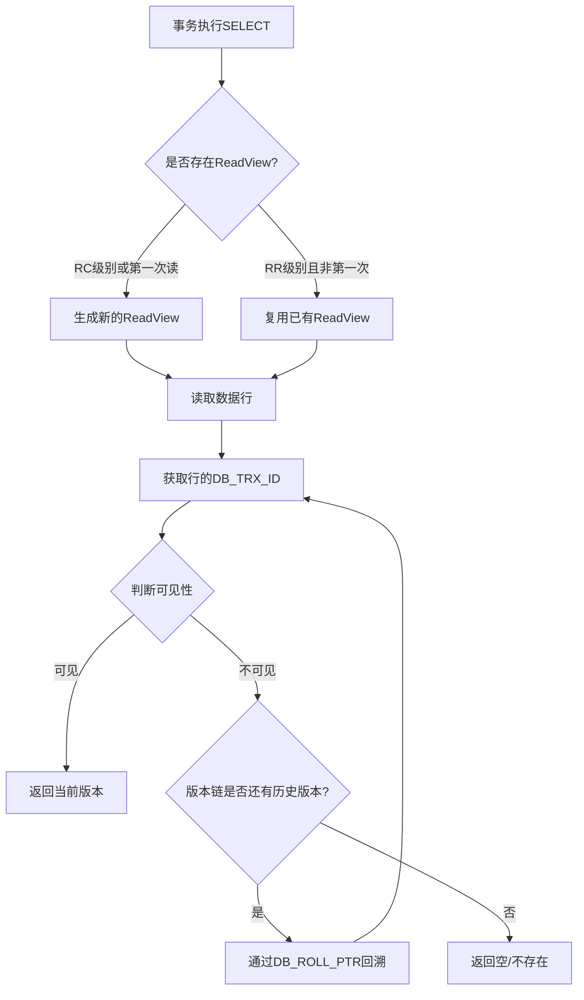

import ResizableImage from "../../src/components/ResizableImage";

---
title: MVCC多版本并发控制
sidebar_position: 3
---

## 一、概述

### 1.1 什么是MVCC

**MVCC**（Multi-Version Concurrency Control，多版本并发控制）是一种用于提高数据库并发性能的技术。它通过保存数据在某个时间点的快照，使得不同事务可以看到不同版本的数据，从而在不完全加锁的情况下实现事务之间的隔离。

在传统的数据库并发控制中，读写操作通常需要加锁来保证数据一致性，这会导致读写之间相互阻塞，严重影响系统的并发性能。MVCC的出现正是为了解决这个问题：

```
传统锁机制的问题：
┌─────────────────────────────────────────────────────┐
│  读-写冲突：读操作需要等待写操作完成                      │
│  写-读冲突：写操作需要等待读操作完成                      │
│  写-写冲突：多个写操作需要排队执行                        │
└─────────────────────────────────────────────────────┘

MVCC的优势：
┌─────────────────────────────────────────────────────┐
│  读-写不冲突：读操作读取历史版本，写操作写入新版本          │
│  提高并发度：大幅减少锁的使用，提升系统吞吐量              │
│  实现快照读：事务可以读取到一致性的数据快照                │
└─────────────────────────────────────────────────────┘
```

### 1.2 MVCC的核心思想

MVCC的核心思想是：**通过保存数据的历史版本，让读操作可以访问之前的数据版本，而不是等待写操作完成**。

这种机制使得：
- **读不阻塞写**：读操作读取的是数据的历史版本（快照），不需要等待正在进行的写操作
- **写不阻塞读**：写操作创建新版本，不影响其他事务读取旧版本
- **只有写-写需要互斥**：同一行数据同一时刻只能有一个事务在修改

### 1.3 MVCC在MySQL中的应用

在MySQL中，MVCC主要在**InnoDB存储引擎**中实现，用于支持**READ COMMITTED**（读已提交）和**REPEATABLE READ**（可重复读）这两种事务隔离级别。通过MVCC，InnoDB能够在这两种隔离级别下实现**一致性非锁定读**（Consistent Nonlocking Read），即普通的SELECT语句不需要加锁就能读取到一致性的数据。

:::tip
**快照读 vs 当前读**

- **快照读（Snapshot Read）**：读取的是数据的历史版本，不加锁。例如普通的 `SELECT` 语句
- **当前读（Current Read）**：读取的是数据的最新版本，需要加锁。例如 `SELECT ... FOR UPDATE`、`SELECT ... LOCK IN SHARE MODE`、`INSERT`、`UPDATE`、`DELETE` 等语句
:::

---

## 二、MVCC实现原理

MySQL InnoDB存储引擎的MVCC实现依赖于三个核心组件：
1. **隐藏字段**：记录事务ID和版本链指针
2. **Undo Log**：存储数据的历史版本
3. **ReadView**：判断数据版本对当前事务是否可见

### 2.1 隐藏字段

InnoDB存储引擎会在每一行数据中添加三个隐藏字段，用于支持MVCC和事务回滚：

<ResizableImage src={require('./img/mvcc_hidden_columns.png').default} alt="InnoDB行记录的隐藏字段" defaultWidth={700} />

| 隐藏字段 | 大小 | 描述 |
|---------|------|------|
| **DB_TRX_ID** | 6字节 | 记录最后一次对该行进行修改（INSERT/UPDATE）的事务ID |
| **DB_ROLL_PTR** | 7字节 | 回滚指针，指向该行在Undo Log中的上一个版本 |
| **DB_ROW_ID** | 6字节 | 隐藏的行ID，如果表没有定义主键，InnoDB会自动生成一个作为聚簇索引 |

:::note
**关于DB_ROW_ID**

- 如果表定义了主键，则使用主键作为聚簇索引，不会生成DB_ROW_ID
- 如果表没有定义主键但有唯一非空索引，则使用该索引作为聚簇索引
- 如果都没有，InnoDB才会自动生成DB_ROW_ID作为隐藏的聚簇索引
:::

**示例：**

假设有一张用户表 `users`：

```sql
CREATE TABLE users (
    id INT PRIMARY KEY,
    name VARCHAR(50),
    age INT
);

INSERT INTO users VALUES (1, '张三', 25);
```

实际存储的数据结构如下：

| id | name | age | **DB_TRX_ID** | **DB_ROLL_PTR** | **DB_ROW_ID** |
|----|------|-----|---------------|-----------------|---------------|
| 1 | 张三 | 25 | 100 | NULL | (不需要) |

当事务ID为100的事务插入这条数据时，`DB_TRX_ID`被设置为100。由于这是首次插入，没有历史版本，所以`DB_ROLL_PTR`为NULL。

---

### 2.2 Undo Log（回滚日志）

#### 2.2.1 Undo Log的作用

Undo Log是MySQL实现**事务原子性**和**MVCC**的核心机制，主要有两个作用：

1. **事务回滚**：当事务执行失败或主动回滚时，通过Undo Log可以将数据恢复到修改前的状态
2. **MVCC版本链**：Undo Log保存了数据的历史版本，使得其他事务可以读取到一致性的快照数据

#### 2.2.2 Undo Log的类型

Undo Log根据操作类型分为两种：

| 类型 | 触发操作 | 说明 |
|------|---------|------|
| **insert undo log** | INSERT | 插入操作产生的Undo Log，事务提交后可立即删除 |
| **update undo log** | UPDATE / DELETE | 修改和删除操作产生的Undo Log，需要保留一段时间供MVCC读取 |

:::important
DELETE操作在InnoDB中并不是真正的物理删除，而是将记录标记为**已删除**（delete mark），通过更新DB_TRX_ID和DB_ROLL_PTR来记录删除操作。实际的物理删除由后台的**purge线程**在确认没有事务需要读取该版本后才执行。
:::

#### 2.2.3 版本链的形成

当一条记录被多次修改时，InnoDB会将每次修改前的值保存到Undo Log中，并通过`DB_ROLL_PTR`指针将这些历史版本串联起来，形成一条**版本链**（Version Chain）。

<ResizableImage src={require('./img/mvcc_undo_log_chain.png').default} alt="Undo Log版本链" defaultWidth={750} />

**示例过程：**

假设对`users`表中`id=1`的记录进行多次更新：

```sql
-- 初始状态：事务100插入数据
INSERT INTO users VALUES (1, '张三', 25);  -- trx_id = 100

-- 事务200更新年龄为26
UPDATE users SET age = 26 WHERE id = 1;    -- trx_id = 200

-- 事务300更新年龄为28
UPDATE users SET age = 28 WHERE id = 1;    -- trx_id = 300
```

版本链的形成过程：

```
当前数据行                           Undo Log
┌──────────────────────┐            ┌──────────────────────┐
│ id=1, name=张三       │            │ id=1, name=张三       │
│ age=28               │            │ age=26               │
│ DB_TRX_ID=300        │ ───────►   │ DB_TRX_ID=200        │ ───────►
│ DB_ROLL_PTR ─────────┼────┘       │ DB_ROLL_PTR ─────────┼────┘
└──────────────────────┘            └──────────────────────┘
       最新版本                              ▼
                                    ┌──────────────────────┐
                                    │ id=1, name=张三       │
                                    │ age=25               │
                                    │ DB_TRX_ID=100        │
                                    │ DB_ROLL_PTR=NULL     │
                                    └──────────────────────┘
                                           初始版本
```

通过版本链，事务可以根据自己的需求（由ReadView决定）回溯到对应的历史版本，读取到一致性的数据快照。

---

### 2.3 ReadView（读视图）

#### 2.3.1 什么是ReadView

**ReadView**是MVCC机制中用于**判断数据版本可见性**的核心组件。当事务执行**快照读**（普通SELECT）时，InnoDB会生成一个ReadView，用于确定在版本链中哪个版本的数据对当前事务可见。

<ResizableImage src={require('./img/mvcc_readview.png').default} alt="ReadView结构" defaultWidth={700} />

#### 2.3.2 ReadView的组成

ReadView包含以下四个核心字段：

| 字段 | 说明 |
|------|------|
| **m_ids** | 生成ReadView时，系统中所有**活跃事务**（已启动但未提交）的事务ID列表 |
| **min_trx_id** | `m_ids`列表中的最小值，即最小的活跃事务ID |
| **max_trx_id** | 生成ReadView时，系统应该分配给**下一个事务**的ID值（即当前最大事务ID + 1） |
| **creator_trx_id** | 生成该ReadView的事务本身的ID |

:::note
**m_ids、min_trx_id、max_trx_id 的关系**

- `m_ids` 是活跃事务ID的集合
- `min_trx_id = min(m_ids)`，是活跃事务中最小的ID
- `max_trx_id` 不一定等于 `max(m_ids) + 1`，因为事务ID是递增分配的，可能存在已提交的事务ID大于某些活跃事务ID的情况
:::

#### 2.3.3 可见性判断规则

当事务要读取某一行数据时，会获取该行的`DB_TRX_ID`，然后与ReadView进行比较，判断该版本是否可见：

<ResizableImage src={require('./img/mvcc_visibility_flowchart.png').default} alt="可见性判断流程" defaultWidth={700} />

**详细判断规则：**

1. **如果 `DB_TRX_ID == creator_trx_id`**
   - **结果：可见**
   - 说明：该版本是当前事务自己修改的，当然可见

2. **如果 `DB_TRX_ID < min_trx_id`**
   - **结果：可见**
   - 说明：该版本的事务在当前ReadView生成之前就已经提交了

3. **如果 `DB_TRX_ID >= max_trx_id`**
   - **结果：不可见**
   - 说明：该版本的事务是在当前ReadView生成之后才开始的

4. **如果 `min_trx_id <= DB_TRX_ID < max_trx_id`**
   - 需要进一步判断`DB_TRX_ID`是否在`m_ids`列表中：
     - **在`m_ids`中**：不可见，说明该事务在ReadView生成时还未提交
     - **不在`m_ids`中**：可见，说明该事务在ReadView生成前已经提交

**判断规则伪代码：**

```java
boolean isVisible(long trxId, ReadView readView) {
    // 规则1：自己修改的，可见
    if (trxId == readView.creatorTrxId) {
        return true;
    }
    
    // 规则2：在ReadView创建前就已提交，可见
    if (trxId < readView.minTrxId) {
        return true;
    }
    
    // 规则3：在ReadView创建后才开始，不可见
    if (trxId >= readView.maxTrxId) {
        return false;
    }
    
    // 规则4：需要判断是否在活跃事务列表中
    if (readView.mIds.contains(trxId)) {
        return false;  // 还未提交，不可见
    }
    return true;  // 已提交，可见
}
```

#### 2.3.4 版本链回溯

如果当前版本对事务不可见，InnoDB会通过`DB_ROLL_PTR`沿着版本链向前回溯，查找上一个版本，再次进行可见性判断，直到找到一个可见的版本或者到达版本链的尽头（返回空）。

**回溯过程示例：**

```
事务A（trx_id=400）执行 SELECT * FROM users WHERE id=1

ReadView: {
    m_ids: [300, 350],
    min_trx_id: 300,
    max_trx_id: 400,
    creator_trx_id: 400
}

版本链：
[当前行: age=28, trx_id=300] → [Undo: age=26, trx_id=200] → [Undo: age=25, trx_id=100]

判断过程：
1. 检查当前行（trx_id=300）
   - 300 不等于 creator_trx_id(400)
   - 300 不小于 min_trx_id(300)
   - 300 在 m_ids[300,350] 中 → 不可见！
   
2. 沿版本链回溯，检查 trx_id=200
   - 200 < min_trx_id(300) → 可见！
   
3. 返回 age=26

事务A读取到的 age 值是 26，而不是最新的 28
```

---

## 三、隔离级别与ReadView

### 3.1 ReadView生成时机的差异

MVCC在**READ COMMITTED**和**REPEATABLE READ**两种隔离级别下的主要区别在于**ReadView的生成时机不同**：

<ResizableImage src={require('./img/mvcc_isolation_levels.png').default} alt="不同隔离级别下ReadView的生成时机" defaultWidth={750} />

| 隔离级别 | ReadView生成时机 | 效果 |
|---------|-----------------|------|
| **READ COMMITTED** | 每次执行快照读时都生成新的ReadView | 每次读取都能看到最新已提交的数据 |
| **REPEATABLE READ** | 只在事务第一次快照读时生成ReadView，后续复用 | 事务期间多次读取结果一致 |

### 3.2 READ COMMITTED下的MVCC

在RC隔离级别下，每次SELECT都会创建新的ReadView：

```sql
-- 事务A (trx_id=100)                    -- 事务B (trx_id=200)
BEGIN;                                    BEGIN;
                                          
SELECT age FROM users WHERE id=1;         
-- ReadView1: m_ids=[100,200]
-- 读取到 age=25
                                          UPDATE users SET age=26 WHERE id=1;
                                          COMMIT;
                                          
SELECT age FROM users WHERE id=1;
-- ReadView2: m_ids=[100]  -- 因为事务B已提交
-- 读取到 age=26  -- 看到了事务B的修改
                                          
COMMIT;
```

**特点**：每次读取都能看到其他事务最新提交的数据，因此同一事务内两次读取结果可能不同（不可重复读）。

### 3.3 REPEATABLE READ下的MVCC

在RR隔离级别下，只有第一次SELECT才会创建ReadView，之后复用：

```sql
-- 事务A (trx_id=100)                    -- 事务B (trx_id=200)
BEGIN;                                    BEGIN;
                                          
SELECT age FROM users WHERE id=1;         
-- 创建ReadView: m_ids=[100,200]
-- 读取到 age=25
                                          UPDATE users SET age=26 WHERE id=1;
                                          COMMIT;
                                          
SELECT age FROM users WHERE id=1;
-- 复用之前的ReadView: m_ids=[100,200]
-- trx_id=200 在 m_ids 中，不可见
-- 仍然读取到 age=25  -- 不受事务B影响
                                          
COMMIT;
```

**特点**：事务期间多次读取同一行数据，结果始终一致，实现了可重复读。

### 3.4 RR级别下幻读问题的解决

在RR隔离级别下，InnoDB通过MVCC配合**临键锁（Next-Key Lock）**来解决幻读问题：

- **快照读**：通过MVCC，多次读取看到的是同一份快照数据，不会出现幻读
- **当前读**：通过加临键锁（记录锁+间隙锁），阻止其他事务在查询范围内插入新记录

```sql
-- 快照读场景（MVCC解决）
BEGIN;
SELECT * FROM users WHERE age > 20;  -- 假设返回2条记录
-- 其他事务插入 age=25 的记录并提交
SELECT * FROM users WHERE age > 20;  -- 仍然返回2条记录（MVCC快照）
COMMIT;

-- 当前读场景（临键锁解决）
BEGIN;
SELECT * FROM users WHERE age > 20 FOR UPDATE;  -- 加临键锁
-- 其他事务尝试插入 age=25 的记录 → 被阻塞
COMMIT;
```

---

## 四、MVCC执行流程详解

### 4.1 完整执行流程

下面通过一个完整的示例来展示MVCC的执行流程：

```sql
-- 初始数据：users表有一条记录 (id=1, name='张三', age=25)，由事务50插入

-- 时间线：
-- T1: 事务100开始
-- T2: 事务200开始
-- T3: 事务100执行第一次SELECT
-- T4: 事务200执行UPDATE并提交
-- T5: 事务300开始并执行UPDATE
-- T6: 事务100执行第二次SELECT
-- T7: 事务300提交
-- T8: 事务100执行第三次SELECT
```

**详细执行过程（以RR隔离级别为例）：**

**T1-T2：事务开始**
```
事务100开始，分配 trx_id = 100
事务200开始，分配 trx_id = 200
```

**T3：事务100第一次SELECT**
```sql
SELECT * FROM users WHERE id = 1;
```

```
1. 生成ReadView:
   - m_ids = [100, 200]（当前活跃事务）
   - min_trx_id = 100
   - max_trx_id = 201
   - creator_trx_id = 100

2. 读取数据行，DB_TRX_ID = 50

3. 可见性判断：
   - 50 != 100 (不是自己)
   - 50 < 100 (min_trx_id) → 可见！

4. 返回结果：age = 25
```

**T4：事务200执行UPDATE并提交**
```sql
UPDATE users SET age = 28 WHERE id = 1;
COMMIT;
```

```
1. 将原数据 (age=25, trx_id=50) 写入Undo Log
2. 更新当前行：age=28, DB_TRX_ID=200
3. 设置 DB_ROLL_PTR 指向Undo Log中的旧版本
4. 提交事务200

版本链：[当前行: age=28, trx_id=200] → [Undo: age=25, trx_id=50]
```

**T5：事务300开始并UPDATE**
```sql
BEGIN;
UPDATE users SET age = 30 WHERE id = 1;
-- 未提交
```

```
1. 将当前数据 (age=28, trx_id=200) 写入Undo Log
2. 更新当前行：age=30, DB_TRX_ID=300

版本链：[当前行: age=30, trx_id=300] → [Undo: age=28, trx_id=200] → [Undo: age=25, trx_id=50]
```

**T6：事务100第二次SELECT**
```sql
SELECT * FROM users WHERE id = 1;
```

```
1. 复用之前的ReadView（RR级别）:
   - m_ids = [100, 200]
   - min_trx_id = 100
   - max_trx_id = 201

2. 读取当前行，DB_TRX_ID = 300

3. 可见性判断：
   - 300 >= 201 (max_trx_id) → 不可见！

4. 沿版本链回溯，检查 trx_id=200
   - 200 >= 100 且 < 201
   - 200 在 m_ids[100,200] 中 → 不可见！

5. 继续回溯，检查 trx_id=50
   - 50 < 100 (min_trx_id) → 可见！

6. 返回结果：age = 25（与第一次读取一致）
```

**T8：事务100第三次SELECT（事务300已提交后）**
```sql
-- 假设事务300在T7提交
SELECT * FROM users WHERE id = 1;
```

```
在RR级别下，仍然复用最初的ReadView，结果仍为 age=25
在RC级别下，会生成新的ReadView，可以看到最新提交的数据
```

### 4.2 流程总结



---

## 五、MVCC的优缺点

### 5.1 优点

| 优点 | 说明 |
|------|------|
| **提高并发性能** | 读写不互相阻塞，大幅提升数据库的并发处理能力 |
| **实现一致性读** | 事务可以看到一个一致性的数据快照，不受其他事务影响 |
| **减少锁开销** | 快照读不需要加锁，减少了锁的竞争和死锁的可能性 |
| **支持事务隔离** | 通过不同的ReadView策略，支持RC和RR隔离级别 |

### 5.2 缺点

| 缺点 | 说明 |
|------|------|
| **额外存储空间** | 需要存储Undo Log来保存历史版本，占用额外存储空间 |
| **维护版本链开销** | 每次更新都需要维护版本链，有一定的写入开销 |
| **Purge线程开销** | 需要后台线程定期清理不再需要的历史版本 |

### 5.3 与LBCC的对比

| 维度 | MVCC（多版本并发控制） | LBCC（基于锁的并发控制） |
|------|----------------------|------------------------|
| **并发度** | 高，读写不互斥 | 低，读写互斥 |
| **实现方式** | 版本链 + ReadView | 各种粒度的锁 |
| **存储开销** | 需要额外空间存储历史版本 | 仅需存储锁信息 |
| **适用场景** | 读多写少 | 写操作频繁 |
| **数据一致性** | 最终一致性（快照） | 强一致性 |

---

## 六、常见问题

### 6.1 MVCC能否解决幻读问题？

**部分可以**。在RR隔离级别下：
- **快照读**：通过MVCC的ReadView机制可以避免幻读，因为多次读取使用同一个快照
- **当前读**：需要配合临键锁（Next-Key Lock）来防止幻读

### 6.2 为什么READ UNCOMMITTED不使用MVCC？

READ UNCOMMITTED允许读取未提交的数据（脏读），不需要版本控制，直接读取当前最新的数据即可。

### 6.3 为什么SERIALIZABLE不使用MVCC？

SERIALIZABLE级别要求完全串行化执行，所有读操作都转换为当前读（加锁），不使用快照读，因此不需要MVCC。

### 6.4 长事务对MVCC有什么影响？

长事务会导致以下问题：
- **Undo Log无法及时清理**：因为长事务可能还需要读取历史版本
- **存储空间增长**：历史版本持续累积，占用大量存储空间
- **性能下降**：版本链过长会导致回溯查询变慢

**建议**：避免长事务，尽量缩短事务执行时间。

---

## 七、总结

MySQL InnoDB的MVCC机制是一种高效的并发控制方案，通过以下核心组件协同工作：

1. **隐藏字段**（DB_TRX_ID、DB_ROLL_PTR、DB_ROW_ID）：记录事务信息和版本指针
2. **Undo Log**：存储历史版本，形成版本链
3. **ReadView**：判断版本可见性，实现快照读

MVCC的核心价值在于实现了**读写不阻塞**，大幅提升了数据库的并发性能。通过不同的ReadView生成策略，支持了READ COMMITTED和REPEATABLE READ两种隔离级别，在保证数据一致性的同时最大化了系统吞吐量。

理解MVCC的原理，对于数据库性能优化、问题排查以及系统设计都有重要意义。