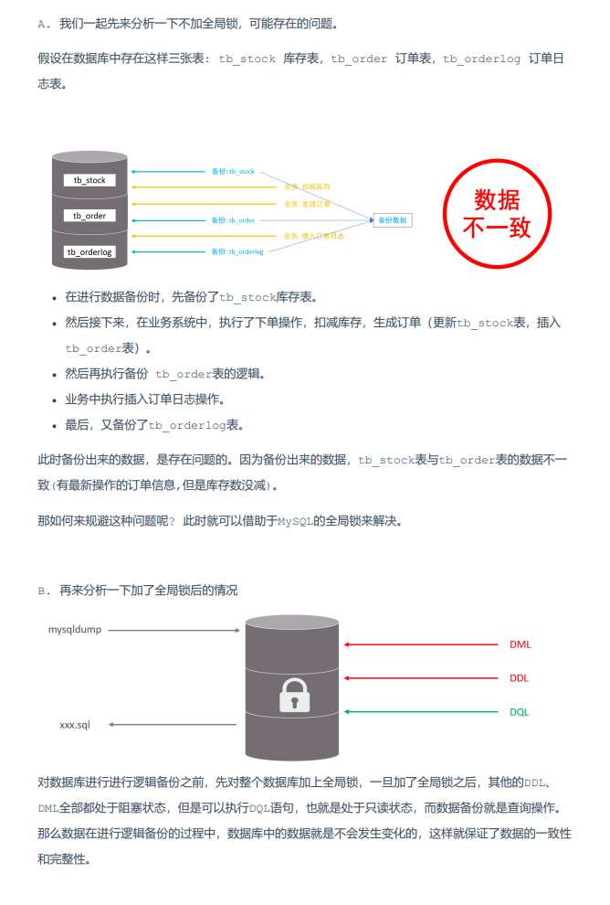

import ResizableImage from "../../src/components/ResizableImage";

## 一、概述
### 1.1 MySQL锁的由来
客户端发往 MySQL 的一条条 SQL 语句，实际上都可以理解成一个个单独的事务（一条 sql 语句默认就是一个事务）。而事务是基于数据库连接的，每个数据库连接在 MySQL 中，
又会用一条工作线程来维护，也意味着一个事务的执行，本质上就是一条工作线程在执行，当出现多个事务同时执行时，这种情况则被称之为并发事务，所谓的并发事务也就是指多条线程并发执行。

多线程并发执行自然就会出问题，也就是脏写、脏读、不可重复读及幻读问题。而对于这些问题又可以通过调整事务的隔离级别来避免，
那为什么调整事务的隔离级别后能避免这些问题产生呢？这是因为不同的隔离级别中，工作线程执行SQL语句时，用的锁粒度、类型不同。
### 1.2 锁定义
由以上可知，数据库的锁机制本身是为了解决并发事务带来的问题而诞生的，主要是确保数据库中，多条工作线程并行执行时的数据安全性。

锁是计算机协调多个进程或线程并发访问某一资源的机制。在数据库中，除传统的计算资源（CPU、RAM、I/O）的争用以外，数据也是一种供许多用户共享的资源。
如何保证数据并发访问的一致性、有效性是所有数据库必须解决的一个问题，锁冲突也是影响数据库并发访问性能的一个重要因素。从这个角度来说，锁对数据库而言显得尤其重要，也更加复杂。
### 1.3 锁分类
MySQL 的锁机制与索引机制类似，都是由存储引擎负责实现的，这也就意味着不同的存储引擎，支持的锁也并不同，这里是指不同的引擎实现的锁粒度不同。
但除开从锁粒度来划分锁之外， 其实锁也可以从其他的维度来划分，因此也会造出很多关于锁的名词，下面先简单梳理一下 MySQL 的锁体系：

**以锁粒度的维度划分**
* **全局锁**：锁定数据库中的所有表。加上全局锁之后，整个数据库只能允许读，不允许做任何写操作。
* **表级锁**：每次操作锁住整张表。主要分为三类
  * **表锁**（分为表共享读锁 Read Lock、表独占写锁 Write Lock）
  * **元数据锁**（Meta Data Lock，MDL）：基于表的元数据加锁，加锁后整张表不允许其他事务操作。这里的元数据可以简单理解为一张表的表结构
  * **意向锁**（分为意向共享锁、意向排他锁）：这个是 InnoDB 中为了支持多粒度的锁，为了兼容行锁、表锁而设计的，使得表锁不用检查每行数据是否加锁，使用意向锁来减少表锁的检查
* **行级锁**：每次操作锁住对应的行数据。主要分为三类
  * **记录锁** / Record 锁：也就是行锁，一条记录和一行数据是同一个意思。防止其他事务对此行进行 `UPDATE` 和 `DELETE`，在 RC、RR 隔离级别下都支持
  * **间隙锁** / Gap 锁：锁定索引记录间隙（不含该记录），确保索引记录间隙不变，防止其他事务在这个间隙进行 `INSERT`，产生幻读。在 RR 隔离级别下都支持
  * **临键锁** / Next-Key 锁：间隙锁的升级版，同时具备记录锁+间隙锁的功能，在 RR 隔离级别下支持

**以互斥性的角度划分**
* **共享锁（S锁）**：不同事务之间不会相互排斥、可以同时获取的锁
* **排他锁（X锁）**：不同事务之间会相互排斥、同时只能允许一个事务获取的锁
* **共享排他锁（SX锁）**：MySQL5.7 版本中新引入的锁，主要是解决 SMO 带来的问题

**以操作类型的维度划分**
* **读锁**：查询数据时使用的锁
* **写锁**：执行插入、删除、修改、DDL语句时使用的锁

**以加锁方式的维度划分**
* 显示锁：编写 SQL 语句时，手动指定加锁的粒度
* 隐式锁：执行 SQL 语句时，根据隔离级别自动为 SQL 操作加锁

**以思想的维度划分**
**乐观锁**：每次执行前认为自己会成功，因此先尝试执行，失败时再获取锁
**悲观锁**：每次执行前都认为自己无法成功，因此会先获取锁，然后再执行

## 二、共享锁和排他锁
### 2.1 共享锁
**定义**：一个事务已获取共享锁，当另一个事务尝试对具备共享锁的数据进行读操作时，可正常读；进行写操作时，会被共享锁排斥。
共享锁的意思很简单，也就是不同事务之间不会排斥，可以同时获取锁并执行。但这里所谓的不会排斥，仅仅只是指不会排斥其他事务来读数据，但其他事务尝试写数据时，就会出现排斥性，举个例子理解：
> 事务 `T1` 对 `ID=18` 的数据加了一个共享锁，此时事务 `T2`、`T3` 也来读取 `ID=18` 的这条数据，这时 `T2`、`T3` 是可以获取共享锁执行的；但此刻又来了一个事务 `T4`，它则是想对 `ID=18` 的这条数据执行修改操作，此时共享锁会出现排斥行为，不允许 `T4` 获取锁执行。

在 MySQL 中，我们可以在 SQL 语句后加上相关的关键字来使用共享锁，语法如下：
```SQL
SELECT ... LOCK IN SHARE MODE;
-- MySQL8.0之后也优化了写法，如下：
SELECT ... FOR SHARE;
```
这种通过在 SQL 后添加关键字的加锁形式，被称为显式锁，而实际上为数据库设置了不同的事务隔离级别后，MySQL 也会对 SQL 自动加锁，这种形式则被称之为隐式锁。

## 2.2 排他锁
上面简单的了解了共享锁之后，紧着来看看排他锁，排他锁也被称之为独占锁。

当一个线程获取到独占锁后，会排斥其他线程（进行读写操作），如若其他线程也想对共享资源/同一数据进行操作，必须等到当前线程释放锁并竞争到锁资源才行。

> 值得注意的一点是：排他锁并不是只能用于写操作，对于一个读操作，咱们也可以手动地指定为获取排他锁，**当一个事务在读数据时，获取了排他锁，那当其他事务来读、写同一数据时，都会被排斥**。
> 比如事务 `T1` 对 `ID=18` 的这条数据加了一个排他锁，此时 `T2` 来加排他锁读取这条数据，`T3` 来修改这条数据，都会被 `T1` 排斥。

在MySQL中，可以通过如下方式显式获取独占锁：
```SQL
SELECT ... FOR UPTATE;
```

## 2.3 锁的释放
在前面的测试中，每次都仅获取了锁，但好像从未释放过锁？其实 MySQL 中释放锁的动作都是隐式的，毕竟如果交给咱们来释放，很容易由于操作不当造成死锁问题发生
。因此对于锁的释放工作，MySQL 自己来干，就类似于 JVM 中的 GC 机制一样，把内存释放的工作留给了自己完成。

但对于锁的释放时机，在不同的隔离级别中也并不相同，比如在“读未提交”级别中，是 SQL 执行完成后就立马释放锁；而在“可重复读”级别中，是在事务结束后才会释放。
如果完全按照数据库规范来实现 RC 隔离级别，为了保证其他事务可以读到未提交的数据，那就必须得在 SQL 执行完成后，立马释放掉锁，这时另一个事务才能读到SQL对应写的数据，
但在 InnoDB 引擎中，它基于 MVCC 机制实现了该效果，为此，InnoDB 的 RC 级别中，SQL 执行结束后并不会释放锁。
## 三、全局锁
### 3.1介绍
全局锁就是对整个数据库实例加锁，加锁后整个实例就处于只读状态，后续的DML的写语句，DDL语句，已经更新操作的事务提交语句都将被阻塞。
其典型的使用场景是做全库的逻辑备份，对所有的表进行锁定，从而获取一致性视图，保证数据的完整性。
为什么全库逻辑备份，就需要加全就锁呢？  ——我们分析下不加全局锁可能存在的问题、以及加了全局锁后的情况。

### 3.2 语法
```SQL
# 加全局锁、获取全局锁
flush tables with read lock;  

# 数据备份。具体指令可见 
mysqldump -u 用户名 -p 数据库名 > /back/backup.sql

# 释放全局锁
unlock tables;
```
### 3.3 特点
数据库中加全局锁，是一个比较重的操作，存在以下问题： 
* 如果在主库上备份，那么在备份期间都不能执行更新，业务基本上就得停摆。
* 如果在从库上备份，那么在备份期间从库不能执行主库同步过来的二进制日志（binlog），会导致主从延迟。
* 在 InnoDB 引擎中，我们可以在备份时加上参数 `--single-transaction` 参数来完成不加锁的一致性数据备份。
```SQL
mysqldump --single-transaction -uroot –p123456 test > backup.sql
```
## 四、表级锁
### 4.1 介绍
表级锁，每次操作锁住整张表。锁定粒度大，发生锁冲突的概率最高，并发度最低。应用在 MyISAM、InnoDB、BDB 等存储引擎中。

表级锁：每次操作锁住整张表。主要分为三类

* **表锁**：分为表共享读锁 read lock、表独占写锁 write lock
* **元数据锁**（meta data lock，MDL）：基于表的元数据加锁，加锁后整张表不允许其他事务操作。这里的元数据可以简单理解为一张表的表结构
* **意向锁**（分为意向共享锁、意向排他锁）：这个是 InnoDB 中为了支持多粒度的锁，为了兼容行锁、表锁而设计的，使得表锁不用检查每行数据是否加锁，使用意向锁来减少表锁的检查
### 4.2 表锁
表锁应该是听的最多的一种锁，因为实现起来比较简单，同时应用范围也比较广泛，几乎所有的存储引擎都会支持这个粒度的锁，比如常用的 MyISAM、InnoDB、Memory 等各大引擎都实现了表锁。

使用表锁的开销相对较小，加锁快，不会产生死锁；但是加锁粒度大，发生锁冲突的概率更高，并发度更低。在 InnoDB 存储引擎中不推荐使用表锁，只有在没有事务支持的存储引擎中才会使用，如 MyISAM。

对于表锁，分为两类：
- 表共享读锁（Read Lock）
- 表独占写锁（Write Lock）
语法：
```SQL
-- 加锁
lock tables 表名 read/write;
-- 释放锁
unlock tables; 
```
<ResizableImage src={require('./img/读锁.png').default} alt="读锁" defaultWidth={600} />
左侧为客户端一，对指定表加了读锁，不会影响右侧客户端二的读，但是会阻塞右侧客户端的写。

### 4.3 元数据锁
Meta Data Lock元数据锁，也被简称为 MDL 锁，这是基于表的元数据加锁，什么意思呢？我们在上文讲过：表锁是基于整张表加锁，行锁是基于一条数据加锁，
那这个表的元数据是什么呢？所有存储引擎的表都会存在一个.frm文件，这个文件中主要存储表的结构（DDL语句，包括表结构的定义信息、创建删除修改表等）。
而**MDL锁就是基于.frm文件中的元数据加锁**的。这里的元数据 可以简单理解为就是一张表的表结构。 也就是说，某一张表涉及到未提交的事务时，是不能够修改这张表的表结构的。

MDL加锁过程是系统自动控制，无需显式使用，在访问一张表的时候会自动加上，**当对一张表进行增删改查的时候，加MDL读锁(共享)**；**当对表结构进行变更操作的时候，
加MDL写锁(排他)**。MDL锁主要作用是维护表元数据的数据一致性，在表上有活动事务的时候，不可以对元数据进行写入操作。为了避免DML与DDL冲突，保证读写的正确性。

MDL是在MySQL5.5版本后再开始支持的，一般来说咱们用不上，因此也无需手动获取锁，主要在**更改表结构时使用**，比如你要向一张表创建/删除一个索引、修改一个字段的名称/数据类型、增加/删除一个表字段等这类情况
。因为毕竟当你的表结构正在发生更改，假设此时有其他事务来对表做CRUD操作，自然就会出现问题，比如我刚删了一个表字段，结果另一个事务中又按原本的表结构插入了一条数据，这显然会存在风险，因此MDL锁在加锁后，整张表不允许其他事务做任何操作。

常见的SQL操作，所添加的元数据锁：

| SQL                               | 锁类型                      | 说明                                                                 |
|-----------------------------------|-----------------------------|----------------------------------------------------------------------|
| lock tables 表名 read/write       | SHARED_READ_ONLY / SHARED_NO_READ_WRITE |                                                                      |
| select / select ... lock in share mode | SHARED_READ                 | 与SHARED_READ、SHARED_WRITE兼容，与EXCLUSIVE互斥                      |
| insert / update / delete / select ... for update | SHARED_WRITE               | 与SHARED_READ、SHARED_WRITE兼容，与EXCLUSIVE互斥                      |
| alter table ...                   | EXCLUSIVE                   | 与其他的MDL都互斥                                                     |

### 4.4 意向锁
为了避免DML在执行时，加的行锁与表锁的冲突，在InnoDB中引入了意向锁，使得表锁不用检查每行数据是否加锁，使用意向锁来减少表锁的检查。

InnoDB引擎是一种支持多粒度锁的引擎，而意向锁则是InnoDB中为了支持多粒度的锁，为了兼容行锁、表锁而设计的，怎么理解这句话呢？先来看一个例子：

假如没有意向锁，客户端一对表加了行锁后，客户端二如何给表加表锁呢，来通过示意图简单分析一 下：
首先客户端一，开启一个事务，然后执行DML操作，在执行DML语句时，会对涉及到的行加行锁。
<ResizableImage src={require('./img/意向锁1.png').default} alt="意向锁1" defaultWidth={600} />
当客户端二，想对这张表加表锁时，会检查当前表是否有对应的行锁，如果没有，则添加表锁，此时就会从第一行数据，检查到最后一行数据，效率较低。
<ResizableImage src={require('./img/意向锁2.png').default} alt="意向锁2" defaultWidth={600} />
有了意向锁之后：
客户端一，在执行DML操作时，会对涉及的行加行锁，同时也会对该表加上意向锁。
<ResizableImage src={require('./img/意向锁3.png').default} alt="意向锁3" defaultWidth={600} />
而其他客户端，在对这张表加表锁的时候，会根据该表上所加的意向锁来判定是否可以成功加表锁，而不用逐行判断行锁情况了。
<ResizableImage src={require('./img/意向锁4.png').default} alt="意向锁4" defaultWidth={600} />

:::important
假设一张表中有一千万条数据，现在事务`T1`对`ID=8888888`的这条数据加了一个行锁，此时来了一个事务`T2`，想要获取这张表的表级别写锁，
经过前面的一系列讲解，大家应该知道写锁必须为排他锁，也就是在同一时刻内，只允许当前事务操作，如果表中存在其他事务已经获取了锁，目前事务就无法满足“独占性”，因此不能获取锁。

那思考一下，由于`T1`是对`ID=8888888`的数据加了行锁，那T2获取表锁时，是不是得先判断一下表中是否存在其他事务在操作？但因为 InnoDB 中有行锁的概念，
所以表中任何一行数据上都有可能存在事务加锁操作，为了能精准的知道答案，MySQL 就得将整张表的1000W条数据全部遍历一次，然后逐条查看是否有锁存在，那这个效率自然会非常的低。

有人可能会说，慢就慢点怎么了，能接受！但实际上不仅仅存在这个问题，还有另外一个致命问题，比如现在 MySQL 已经判断到了第 567W 行数据，发现前面的数据上都没有锁存在，正在继续往下遍历。

要记住 MySQL 是支持并发事务的，也就是 MySQL 正在扫描后面的每行数据是否存在锁时，万一又来了一个事务在扫描过的数据行上加了个锁怎么办？
比如在第 123W 条数据上加了一个行锁。那难道又重新扫描一遍嘛？这就陷入了死循环，行锁和表锁之间出现了兼容问题。
:::
由于行锁和表锁之间存在兼容性问题，提出了意向锁。意向锁实际上也是一种特殊的表锁，意向锁其实是一种“挂牌告知”的思想，好比日常生活中的出租车，一般都会有一个牌子，表示它目前是“空车”还是“载客”状态，而意向锁也是这个思想。

比如当事务 `T1` 打算对 `ID=8888888` 这条数据加一个行锁之前（行级别的读锁或写锁），就会先加一个表级别的意向锁。此时当事务 `T2` 尝试获取一个表级锁时，
就会先看一下表上是否有意向锁，如果有的话再判断一下与自身是否冲突，比如表上存在一个意向共享锁，目前 `T2` 要获取的是表级别的读锁，那自然不冲突可以获取。
但反之，如果T2要获取一个表级的写锁时，就会出现冲突，`T2` 事务则会陷入阻塞，直至 `T1` 释放了锁（事务结束）为止。